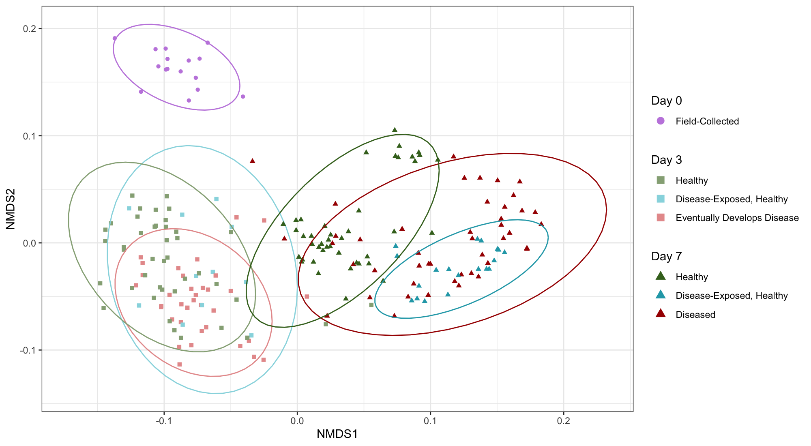

# Code repository for Trytten et al. (2025)
## Tank-based bacterial profiling identifies basin-wide white band disease pathogen candidate and no bacterial associations with host disease resistance
Corresponding Author: Emily Trytten (trytten.e@northeastern.edu)

### Figure 1
  

### Figure 2

### Figure 3
  

### Figure 4
  

### Figure 5
  

### Supplementary Figure S1
  

### Supplementary Figure S2
  
