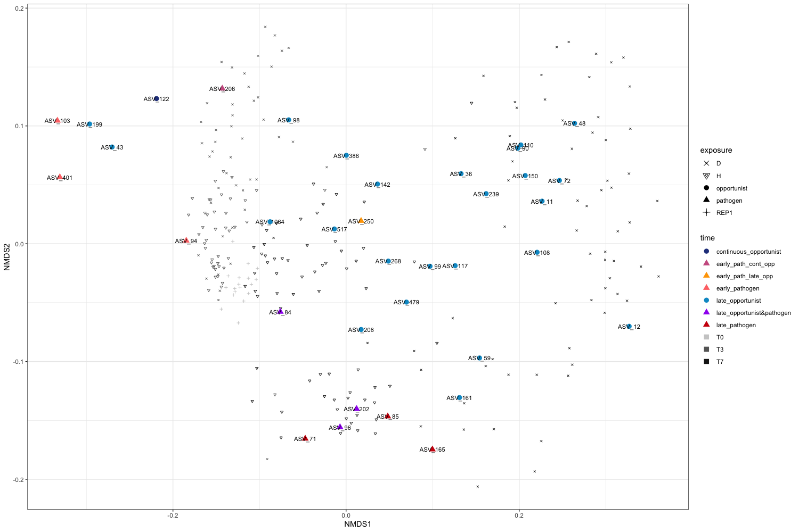
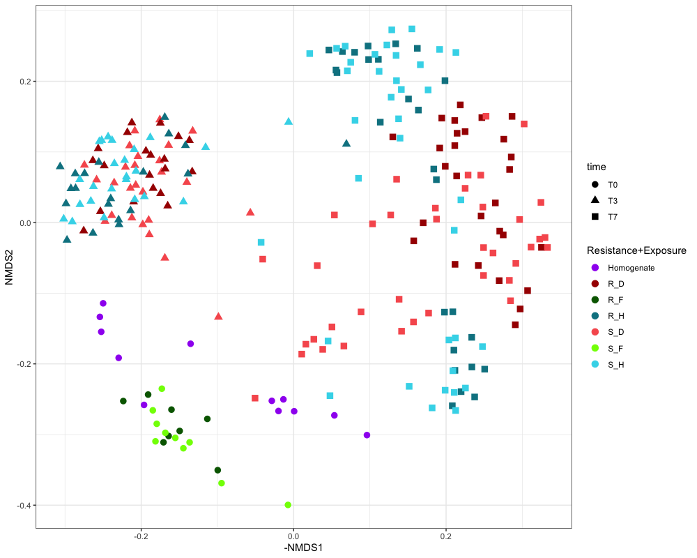
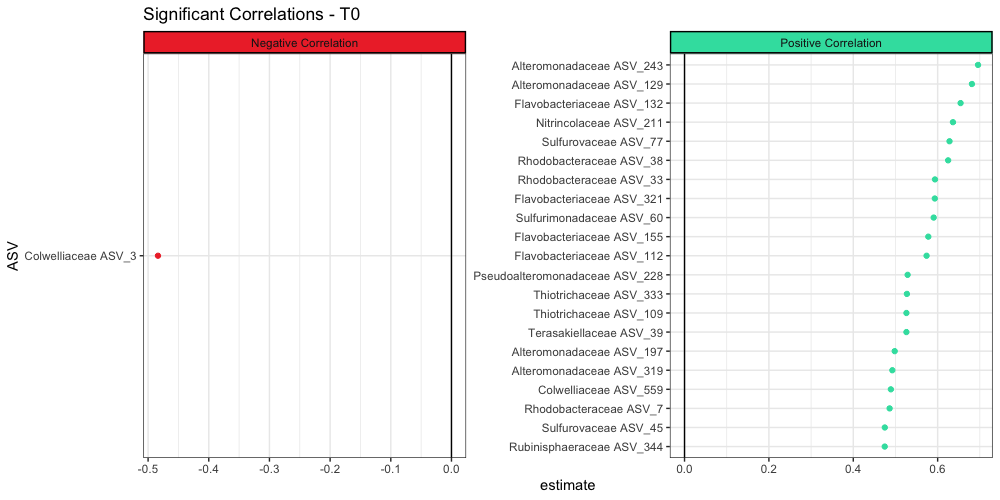
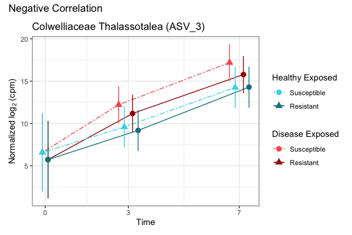
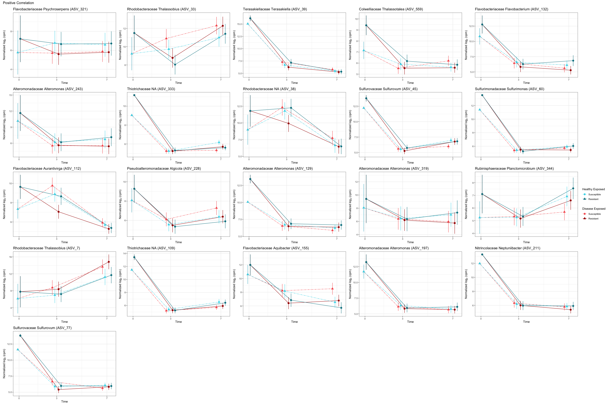
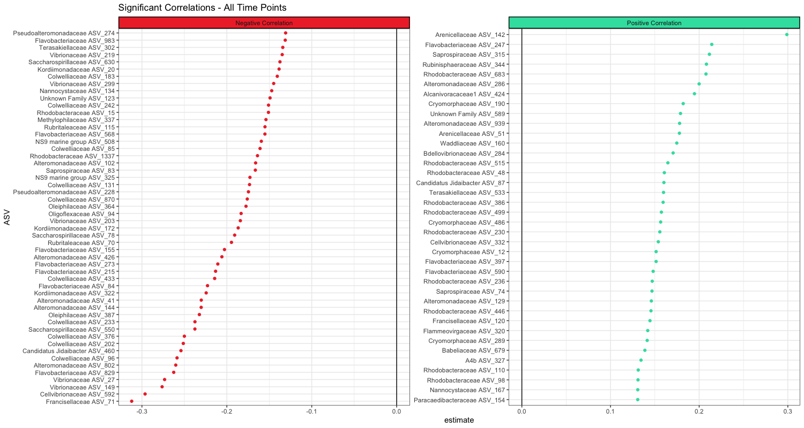
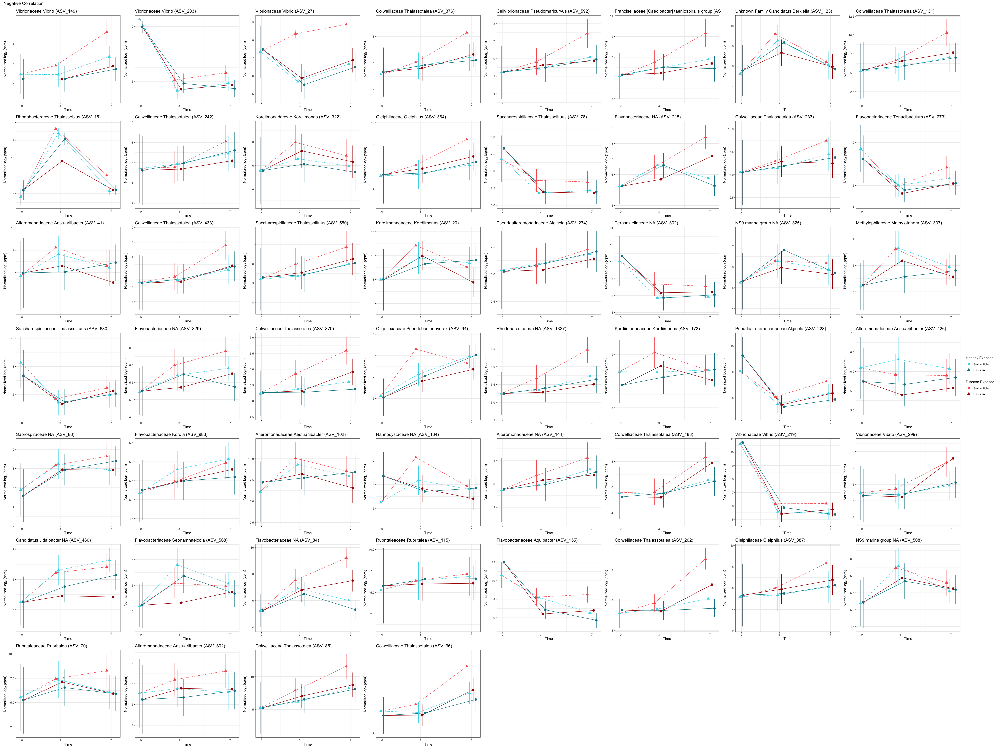
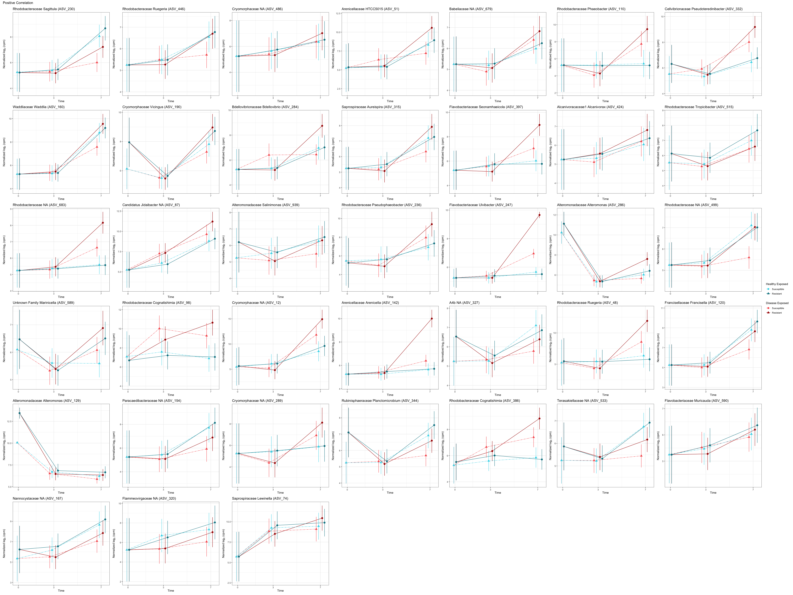

# 16S Florida Tank Analysis

- not filtered for D/T3/T7, removed anything that was only T3 & T7 or only T3 or only T7  
- filter 20% prevalence, less than 90% missingness, remove ASVs with an average of less than *100* cpm per sample

## Somewhat Unfiltered Data
only filtered for 20% prevalence & less than 90% missingness

## Current Model

from Vega Thurber et al 2020:

- filter 20% prevalence, less than 90% missingness, remove ASVs with an average of less than *100* cpm per sample
- lmer model with formula of "log2_cpm ~ treatment + (1 | genotype) + (1 | tank)"
- treatment is time, exposure, and susceptibility all combined into one descriptor
- examine fdr corrected p-values for treatment, genotype, and tank: only keep ASVs w/ significant effect of treatment
- make planned comparisons, then group ASVs into early/late/continuous and probiotic/opportunist/pathogen based on expected profiles for those strategies

**Early Pathogen:** Disease-Exposed Susceptible is greater than Disease-Exposed Resistant at T3  
AND Disease-Exposed Susceptible is greater than the average of all other T3 treatments   
AND Disease-Exposed Susceptible must be more abundant at T3 than T0  
**Late Pathogen:** Disease-Exposed Susceptible is greater than Disease-Exposed Resistant at T7  
AND Disease-Exposed Susceptible is greater than the average of all other T7 treatments   
AND Disease-Exposed Susceptible must be more abundant at T7 than T0  
**Continuous Pathogen:** meets all criteria for both early and late pathogens

**Early Opportunist:** the average of Disease-Exposed is greater than the average of Healthy-Exposed at T3  
AND Disease-Exposed is more abundant at T3 than T0  
**Late Opportunist:** the average of Disease-Exposed is greater than the average of Healthy-Exposed at T7  
AND Disease-Exposed is more abundant at T7 than T0  
**Continuous Opportunist:** meets criteria for both early and late opportunists  

-- none in T0,T3 and anything in probiotic T7 but not probiotic T7 Strict did not look like a probiotic (all treatments had very similar values in most cases) --
**Probiotic_T0:** Disease-Exposed Resistant is more abundant than Disease-Exposed Susceptible at T0  
**Probiotic_T3:** Disease-Exposed Resistant is more abundant than Disease-Exposed Susceptible at T3  
**Probiotic_T7:** Disease-Exposed Resistant is more abundant than Disease-Exposed Susceptible at T7  

**Probiotic_T3_Strict:** Disease-Exposed Resistant is more abundant than Disease-Exposed Susceptible at T3  
AND Disease-Exposed Resistant is more abundant than all other treatments at T3  
AND Disease-Exposed Resistant is more abundant at T3 than Resistant at T0

**Probiotic_T7_Strict:** Disease-Exposed Resistant is more abundant than Disease-Exposed Susceptible at T7   
AND Disease-Exposed Resistant is more abundant than all other treatments at T7  
AND Disease-Exposed Resistant is more abundant at T7 than at T3  
AND Disease-Exposed Resistant is more abundant at T7 than Resistant at T0  

**Crasher_T3:** Susceptible is more abundant at T0 than Disease-Exposed Susceptible is at T3  
**Crasher_T7:** Susceptible is more abundant at T0 than Disease-Exposed Susceptible is at T7    

-- Found None:
**Crasher_T3_Strict:** Susceptible is more abundant at T0 than Disease-Exposed Susceptible is at T3  
AND Disease-Exposed Susceptible is less than the average of all other treatments at T3  
**Crasher_T7_Strict:** Susceptible is more abundant at T0 than Disease-Exposed Susceptible is at T7
AND Disease-Exposed Susceptible is less than the average of all other treatments at T7  

##### Results of Different Levels of Filtering

-- in 0.01% of samples --  
  
  

-- in 0.1% of samples --  
  
  

## significant ASVs - 0.01%

#### ASV NMDS by bacterial strategy

 
ASV as species, sample id as site

  
gray dots are ASVs, colored dots are individual coral fragments

### Correlation Tests
- correlation test (cor.test) between log2cpm abundance and continuous resistance value, p < 0.05
- INITIAL DATA FILTERS: filter 20% prevalence, less than 90% missingness, remove ASVs with an average of less than *100* cpm per sample

##### Correlations based only on T0

##### Correlations based on all timepoints (T0, T3, T7)

### Microbe Abundances
- category titles are "timepoint_exposure_susceptibility"

# OLD MODEL FIGURES

##### Exposure:Final Disease State
- category titles are "timepoint_exposure_final disease state
- **removed** samples that were healthy exposed and contracted WBD

### Remaining ASVs:
##### Sections of interest are 278 and 104 for a total of 305 ASVs

##### 382 ASVs gets reduced to 304 ASVs because 78 are significant for nothing

  

#### If you remove ASVs that are only significant for time, only 172 remain:
##### legend is describing diseased relative to healthy ("up" means it's significantly higher in disease, etc...)

##### only ASVs that are significantly more abundant in D than H:
###### updates to preprocessing data have increased this subset by 35

#### Significant ASV Counts by Family
removed any families where the only significant term in the whole family is time

#### Differences in exposure and final disease state

### Most Abundant Families in each Timepoint and Final Disease State intersection
**aggregated by Family**  

- selected the 20 most abundant Families in each group and ranked 1-20 (1 is most abundant)  
- removed any Family that is only present in one of the six groups

### Likely Suspects
*present in T3, T7, and Diseased bait*  
*AND differs significantly for either final disease state or the interaction of final disease state and time*  

### Very Likely Suspects
*present in T3, T7, and Diseased bait*   
*AND differs significantly for either final disease state or the interaction of final disease state and time*  
*AND significantly more abundant in diseased than healthy*

## Logfold Changes in Bacterial Abundance
- positive logfold change means more disease
- LS vs VLS almost perfectly separates by whether it's more abundant at T3 (LS) or T7 (VLS)

### Potential Link between Rickettsiales and Disease

### PCoA

### NMDS

