# 16S Florida Tank Analysis

### Filters
- minimum 10,000 reads  
- 10% prevalence via phyloseq_filter_prevalence(prev.trh = 0.1)  
- each ASV must be present in at least 10% of individuals
- Analyzing data for Timepoints 3 and 7
- Must be present in the Diseased Homogenate, T3 and T7 samples

### Remaining ASVs:
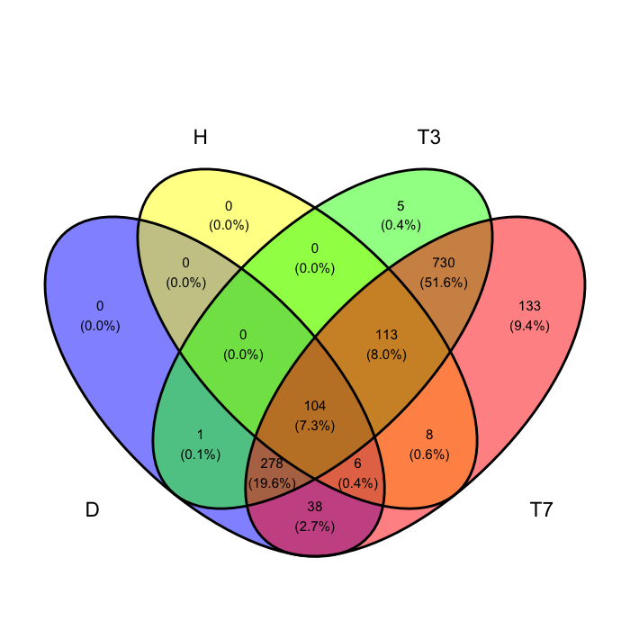

##### Sections of interest are 220 and 85 for a total of 305 ASVs

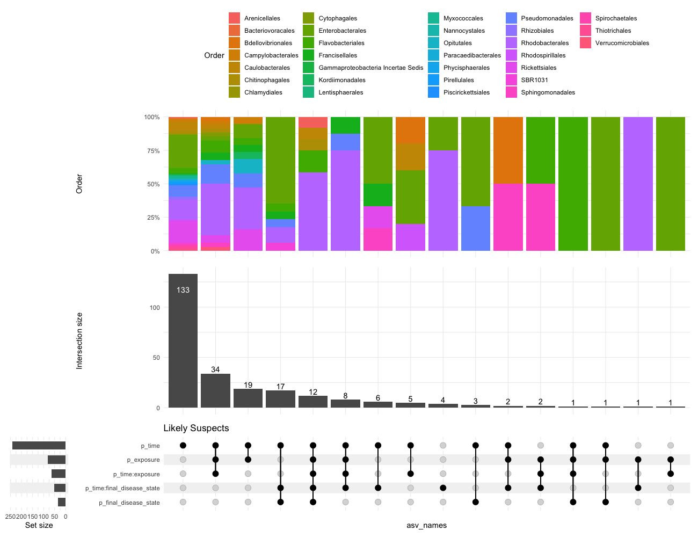

##### 305 ASVs gets reduced to 249 ASVs because 56 are significant for nothing
##### Only 116 remain if you remove ASVs that are only significant for time

#### More Abundant in Disease:
##### (57 ASVs when you don't consider time only)

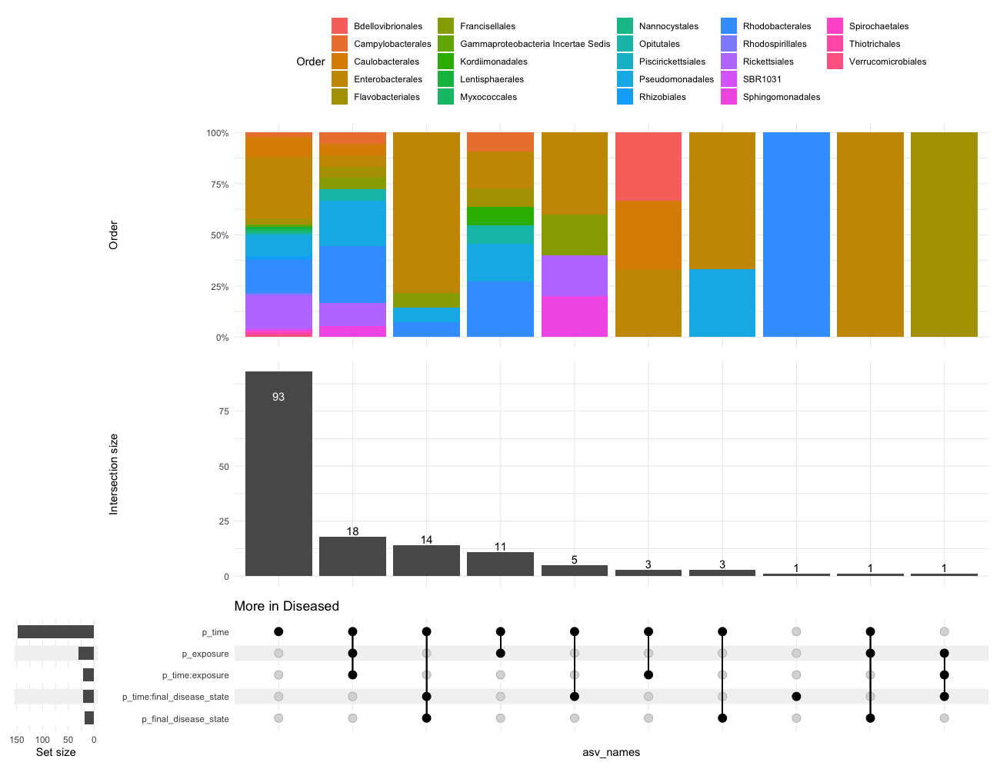  

#### More Abundant in Healthy:

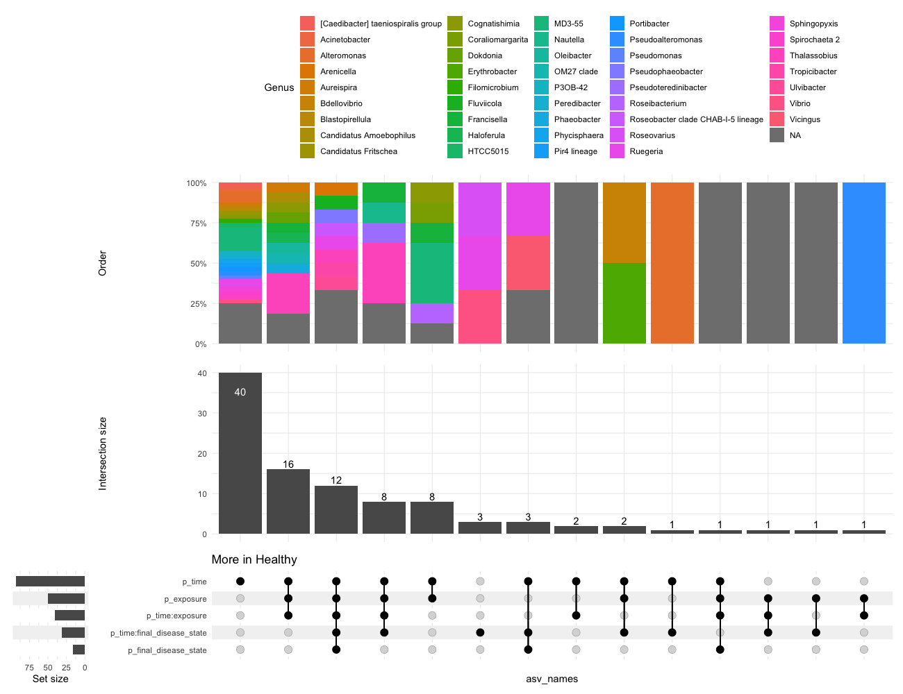

#### Relative Representation of Families of Interest
Of the total number of ASVs present in all of the data within each family, what proportion of those are found in the Likely or Very Likely Suspect Lists?  

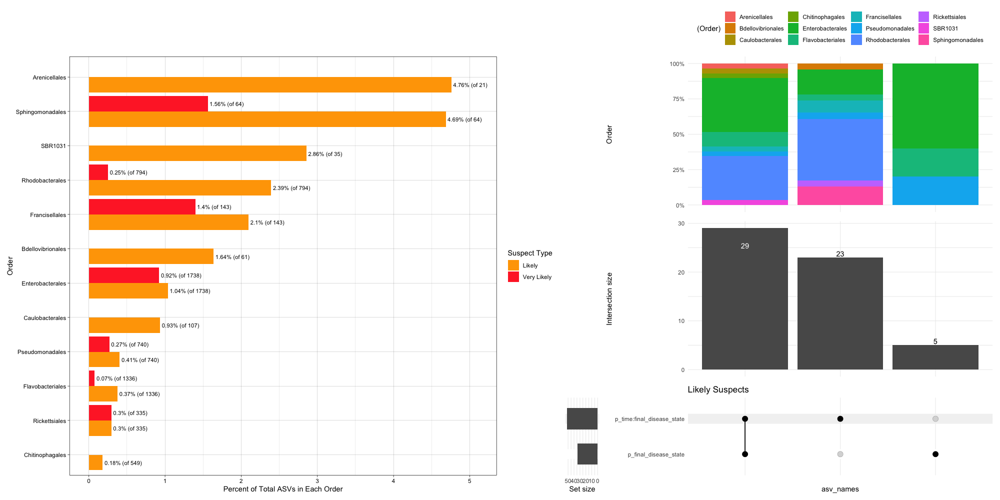

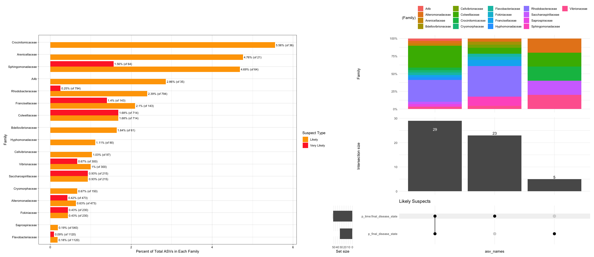

### Highest Abundances 

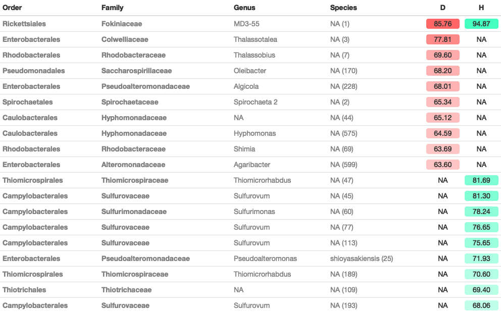

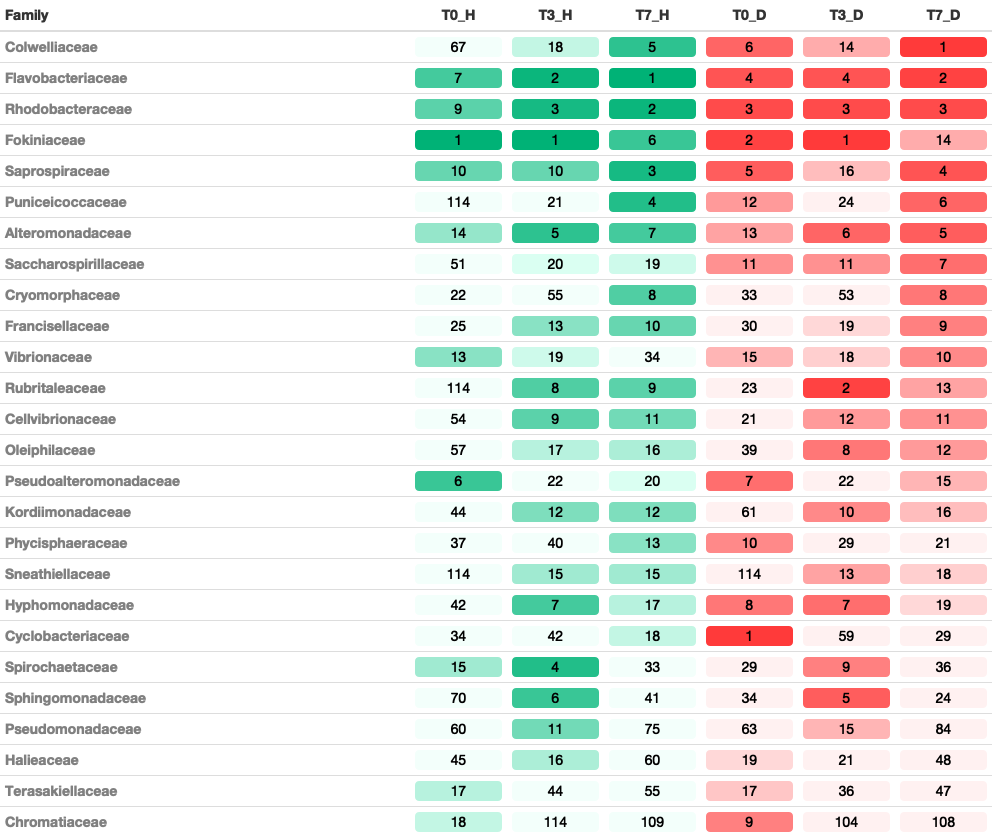

### Likely Suspects
*present in T3, T7, and Diseased bait*
*AND differs significantly for either final disease state or the interaction of final disease state and time*  

### Very Likely Suspects
*present in T3, T7, and Diseased bait*   
*AND differs significantly for either final disease state or the interaction of final disease state and time*  
*AND more abundant in diseased than healthy*

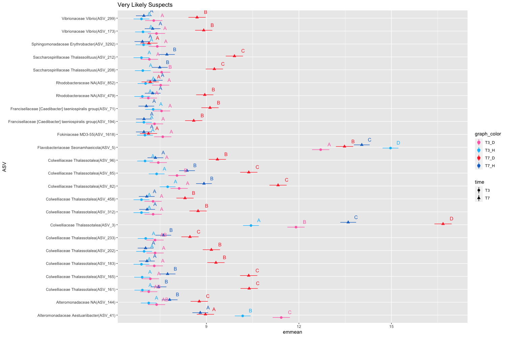

## Logfold Changes in Bacterial Abundance
- positive logfold change means more disease

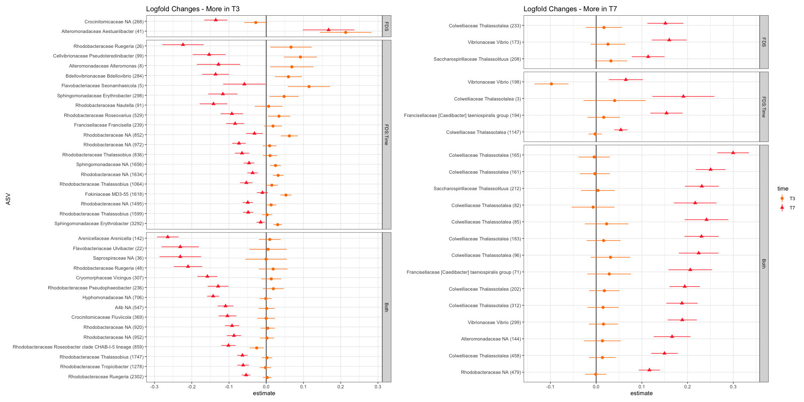

### PCoA and NMDS

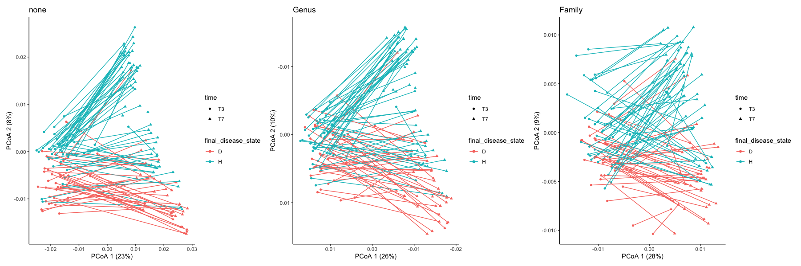

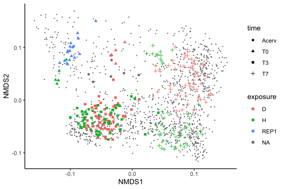

