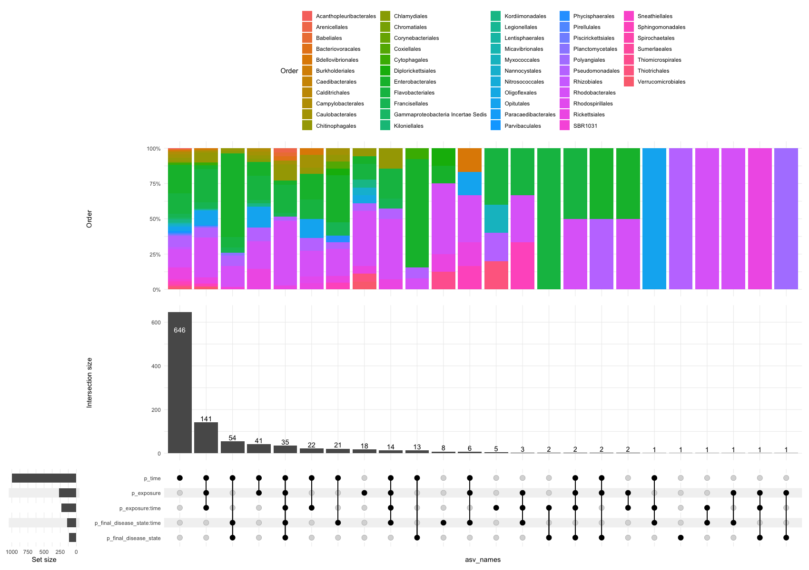
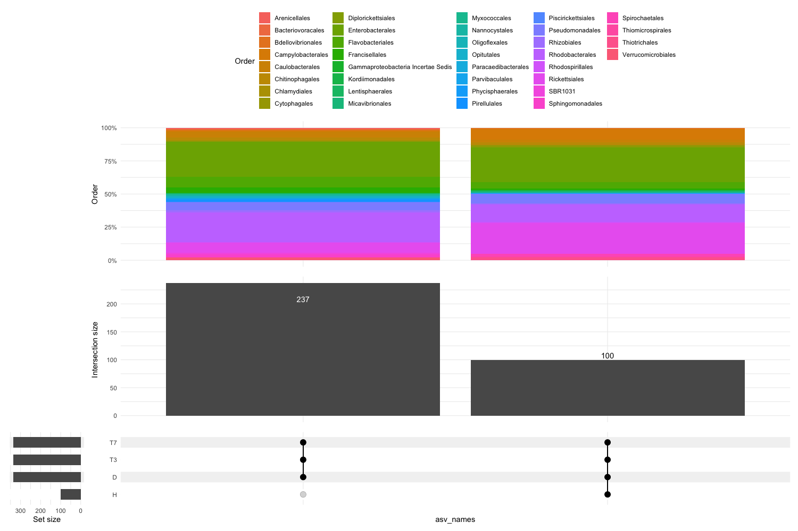
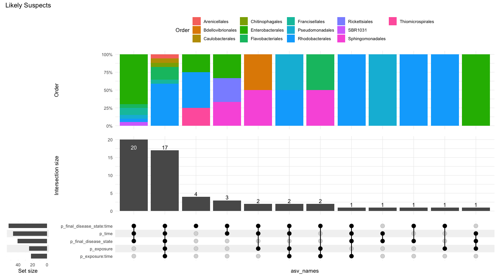
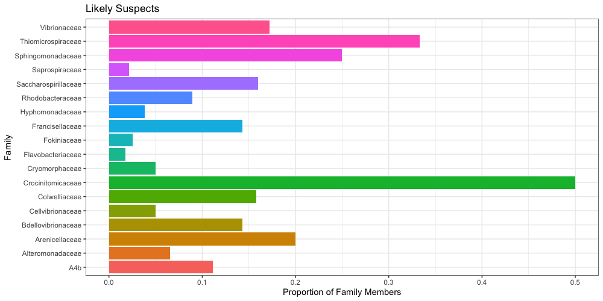
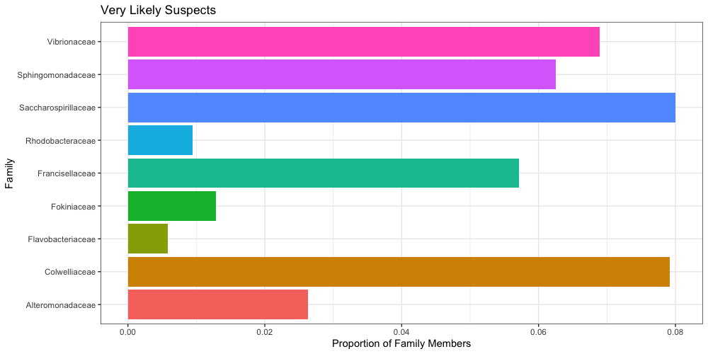
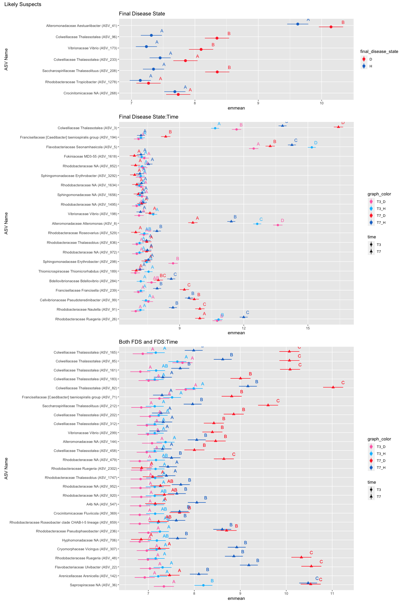
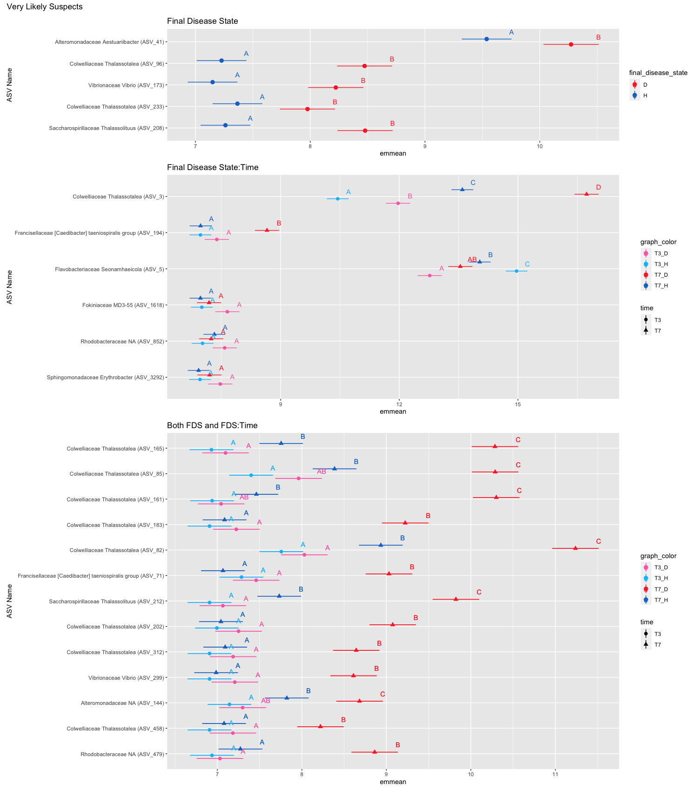
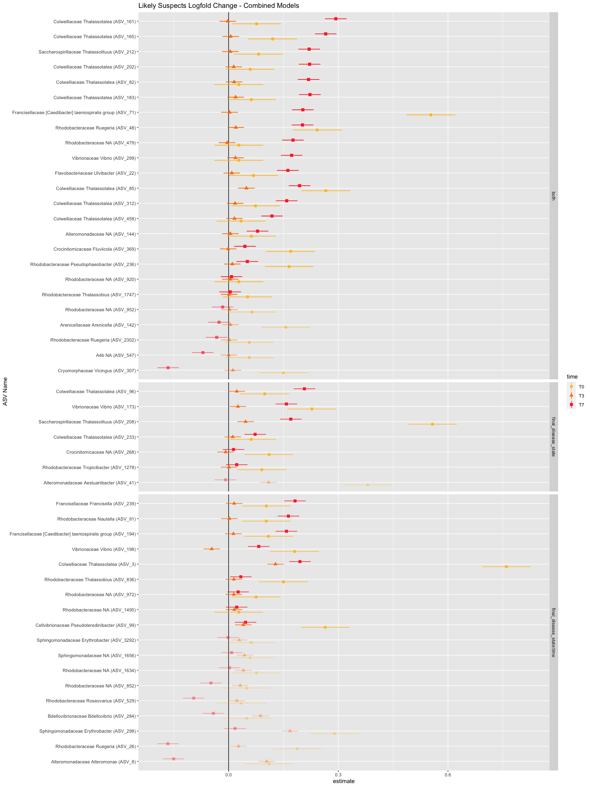
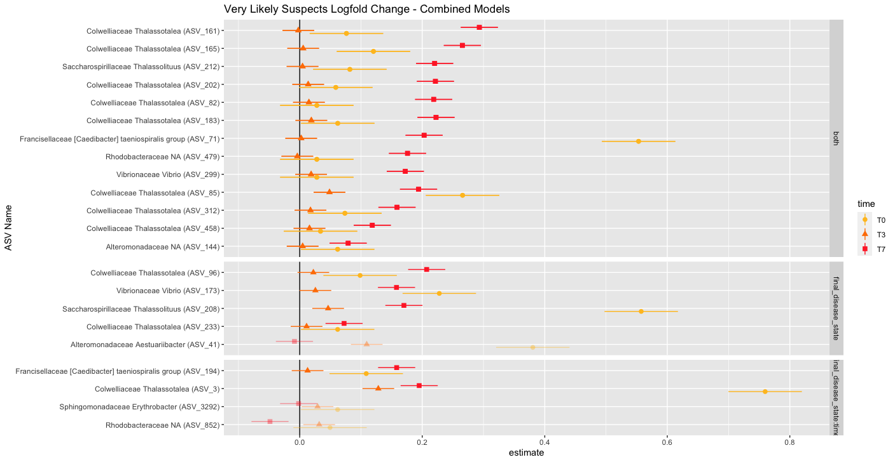
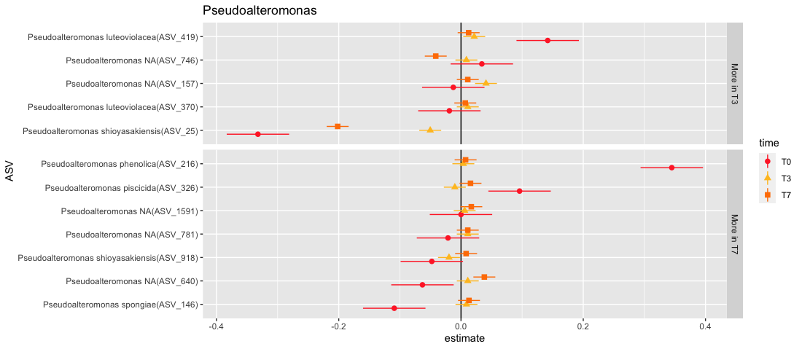

# 16S Florida Tank Analysis

##### All ASVs

##### Likely Suspects

#### Relative Representation of Families of Interest
Of the total number of ASVs present in all of the data within each family, what proportion of those are found in the Likely or Very Likely Suspect Lists?  

### Family Abundances

### Homogenates 

### Likely Suspects
*present in T3, T7, and Diseased bait*

**note:** the significant terms were determined based on the initial repeated measures model run for each ASV:  
    aov_4(value ~ time * (exposure + final_disease_state) + (time | fragment_id), data = data)  
the ASVs for each grouping of significant terms then had its own lmer model run on it which was plugged into emmeans.  The two ASVs that are grouped as being significant for FDS but don't have different significance letters were likely significant for the first model(within each ASV) but not for the second model (run on all ASVs with ASV name as a factor)

### Very Likely Suspects
*present in T3, T7, and Diseased bait*   
*AND differs significantly for either final disease state or the interaction of final disease state and time*  
*AND more abundant in diseased than healthy*

## Logfold Changes in Bacterial Abundance
- positive logfold change means more disease
- filtered based on which ASVs were more abundant in diseased homogenate than healthy homogenate (T0) with the caveat that either the T3 or T7 value had to be a positive logfold change (more in diseased than healthy) 
- faceted by significant terms, alpha indicates whether T3 or T7 was more abundant in disease (translucent means T3 > T7 so likely not what we want)
- ordered within facets by the difference between T7 and T3 values

##### Two separate models (aov_4 for T3,T7 and lmer for T0)

model used (T3 + T7): aov_4(log_value ~time * final_disease_state * asv_names + (1 + time | frag_ASV_id), data = log_emmeans_data_37)

model used (T0): lmer(log_value ~final_disease_state * asv_names + (1 | genotype), data = log_emmeans_data_0)

### Pseudoalteromonas
After skimming the paper you sent about antibacterial activity against SCTLD, I checked really quickly to see if any of the Pseudoalteromonas in our data set were associated w healthy individuals, sorted by T0 logfold change.  *Pseudoalteromonas shioyasakiensis* is the only potential one, but the logfold change isn't that large

### Random Effect Sizes
random effects are larger in the healthy tanks

*tank_model <- lmer(value ~ time + (1 | tank), data = filter(tank_data, final_disease_state == "D"))*

#H: ~ time, tank is 0.0287, ~ tank, time is 0.08549  
#D: ~ time, tank is 0.006784, ~ tank, time is 0.002925  

*tank_exposure_model <- lmer(value ~ final_disease_state + (1 | tank) + (1 | time) + (1 | asv_names), 
                   data = filter(tank_data, exposure == "H"))*  
                   
#H: asv_names - 0.71949, tank - 0.02200, time - 0.07243   
#D: asv_names - 0.744188, tank - 0.003628, time - 0.034126  

