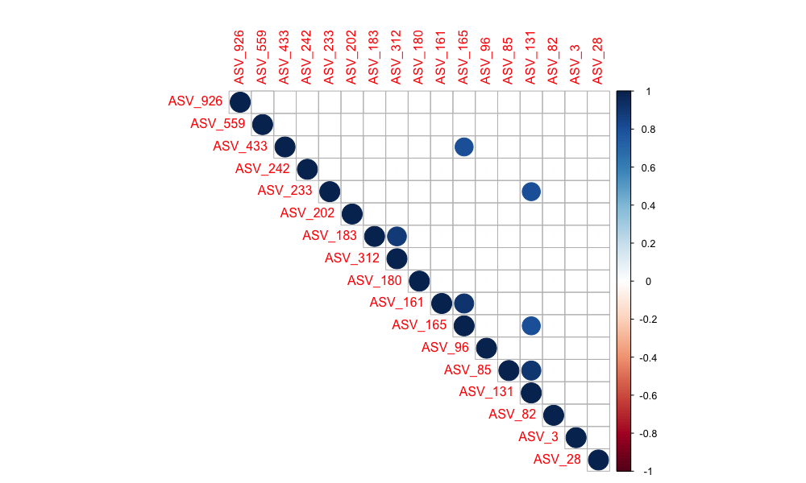
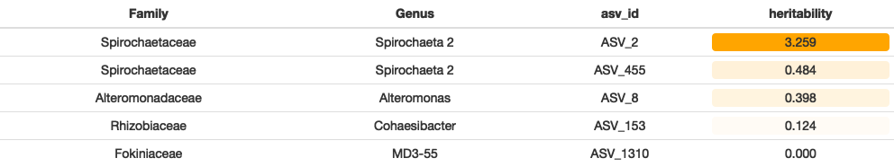
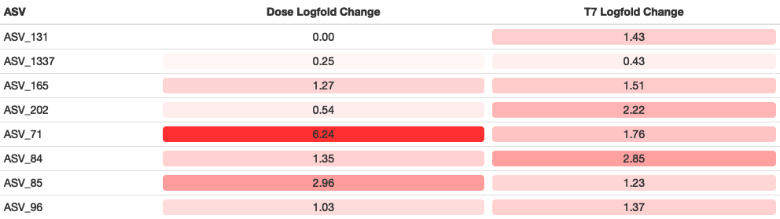
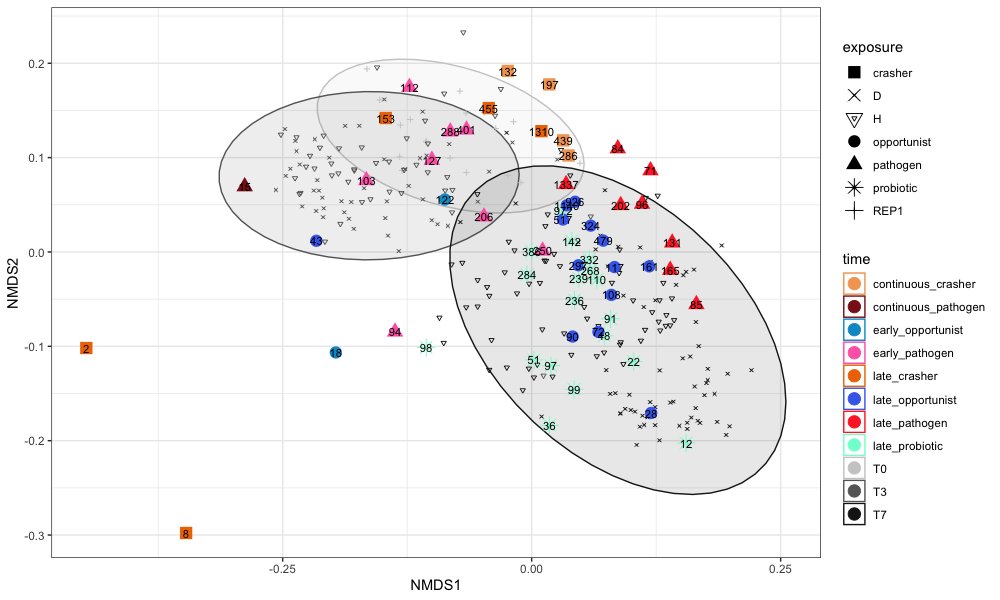
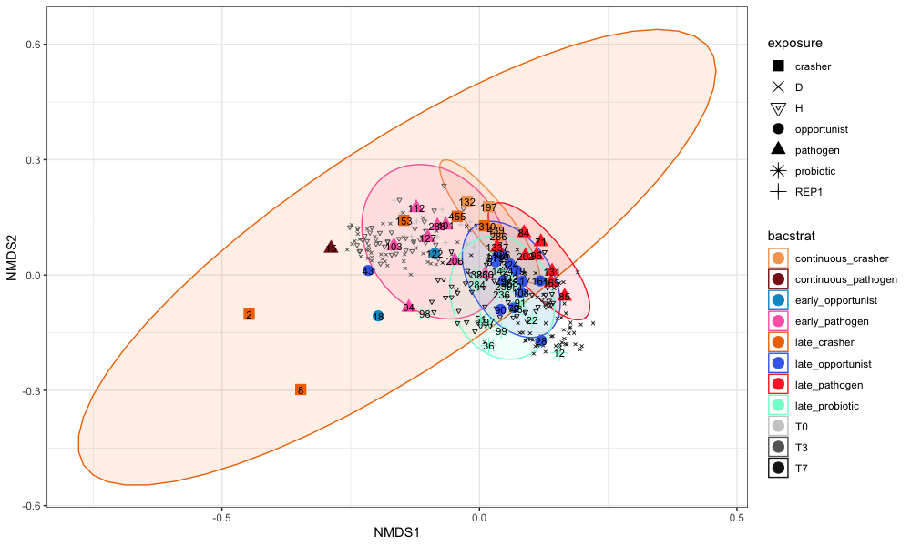
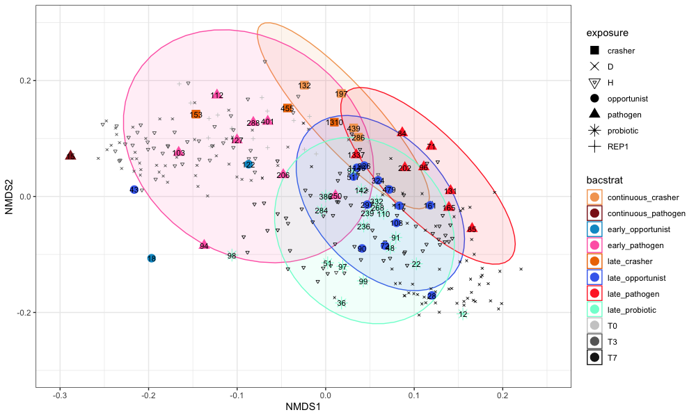

# 16S Florida Tank Analysis

### Somewhat Unfiltered Data
only filtered for 20% prevalence & less than 90% missingness

### Everything that goes into the model:
- filter 20% prevalence, less than 90% missingness, remove ASVs with an average of less than *100* cpm per sample
- removed anything that was only T3 & T7 or only T3 or only T7

## Current Model

from Vega Thurber et al 2020:

- filter 20% prevalence, less than 90% missingness, remove ASVs with an average of less than *100* cpm per sample
- removed anything that was only T3 & T7 or only T3 or only T7  
- lmer model with formula of "log2_cpm ~ treatment + (1 | genotype) + (1 | tank)"
- treatment is time, exposure, and susceptibility all combined into one descriptor
- examine fdr corrected p-values for treatment, genotype, and tank: only keep ASVs w/ significant effect of treatment
- make planned comparisons, then group ASVs into early/late/continuous and probiotic/opportunist/pathogen based on expected profiles for those strategies

**Early Pathogen:** Disease-Exposed Susceptible is greater than Disease-Exposed Resistant at T3  
AND Disease-Exposed Susceptible is greater than the average of all other T3 treatments   
AND Disease-Exposed Susceptible must be more abundant at T3 than T0  
**Late Pathogen:** Disease-Exposed Susceptible is greater than Disease-Exposed Resistant at T7  
AND Disease-Exposed Susceptible is greater than the average of all other T7 treatments   
AND Disease-Exposed Susceptible must be more abundant at T7 than T0  
**Continuous Pathogen:** meets all criteria for both early and late pathogens

**Early Opportunist:** the average of Disease-Exposed is greater than the average of Healthy-Exposed at T3  
AND Disease-Exposed is more abundant at T3 than T0  
**Late Opportunist:** the average of Disease-Exposed is greater than the average of Healthy-Exposed at T7  
AND Disease-Exposed is more abundant at T7 than T0  
**Continuous Opportunist:** meets criteria for both early and late opportunists  

**Probiotic_T7_Strict:** Disease-Exposed Resistant is more abundant than Disease-Exposed Susceptible at T7   
AND Disease-Exposed Resistant is more abundant than all other treatments at T7  
AND Disease-Exposed Resistant is more abundant at T7 than at T3  
AND Disease-Exposed Resistant is more abundant at T7 than Resistant at T0  

**Crasher_T3:** Susceptible is more abundant at T0 than Disease-Exposed Susceptible is at T3  
**Crasher_T7:** Susceptible is more abundant at T0 than Disease-Exposed Susceptible is at T7    

##### Planned Comparisons where Nothing was Found:

-- none in T0,T3 and anything in probiotic T7 but not probiotic T7 Strict did not look like a probiotic (all treatments had very similar values in most cases) --
**Probiotic_T0:** Disease-Exposed Resistant is more abundant than Disease-Exposed Susceptible at T0  
**Probiotic_T3:** Disease-Exposed Resistant is more abundant than Disease-Exposed Susceptible at T3  
**Probiotic_T7:** Disease-Exposed Resistant is more abundant than Disease-Exposed Susceptible at T7  

**Probiotic_T3_Strict:** Disease-Exposed Resistant is more abundant than Disease-Exposed Susceptible at T3  
AND Disease-Exposed Resistant is more abundant than all other treatments at T3  
AND Disease-Exposed Resistant is more abundant at T3 than Resistant at T0

**Crasher_T3_Strict:** Susceptible is more abundant at T0 than Disease-Exposed Susceptible is at T3  
AND Disease-Exposed Susceptible is less than the average of all other treatments at T3  
**Crasher_T7_Strict:** Susceptible is more abundant at T0 than Disease-Exposed Susceptible is at T7
AND Disease-Exposed Susceptible is less than the average of all other treatments at T7  

##### Model Results:

removed T3 and T7 from complex upset because all ASVs are present in both

#### Correlation Matrices

Correlations between the 8 putative pathogen candidates identified by our model  
  

Correlations between all ASVs of the genus Thalassotalea (Colwelliaceaes)  
   

only correlations 0.8 and above   
   

#### Heritability

heritability of the crashers (could indicate compromised host if high heritability)  

  

#### Putative Pathogen Candidates  

  

  

#### ASV NMDS by bacterial strategy  

95% confidence interval around timepoints  
  

95% confidence interval around different bacterial strategies  
  

the above plot, but zoomed in to show the majority of the points (orange ellipse no longer visible bc of zoom)  
  

PCOA with 95% confidence intervals  
  

### Microbe Abundances
- category titles are "timepoint_exposure_susceptibility"

# OLD

### Potential Link between Rickettsiales and Disease

