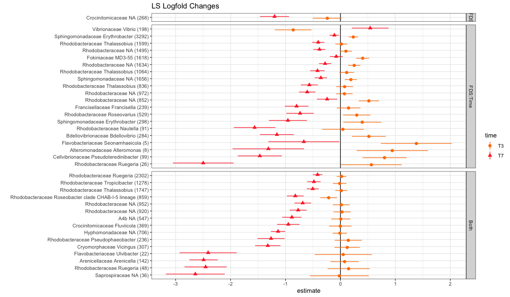

# 16S Florida Tank Analysis

### Filters
- minimum 1,000 reads  
- 10% prevalence via phyloseq_filter_prevalence(prev.trh = 0.1)  
- each ASV must be present in at least 10% of individuals
- Analyzing data for Timepoints 3 and 7
- Must be present in the Diseased Homogenate, T3 and T7 samples

### Remaining ASVs:
##### Sections of interest are 220 and 85 for a total of 305 ASVs

##### 305 ASVs gets reduced to 249 ASVs because 56 are significant for nothing

  

#### If you remove ASVs that are only significant for time, only 116 remain:
##### legend is describing diseased relative to healthy ("up" means it's significantly higher in disease, etc...)

##### only ASVs that are significantly more abundant in D than H:

#### Significant ASV Counts by Family
removed any families where the only significant term in the whole family is time

#### Differences in exposure and final disease state

### Most Abundant Families in each Timepoint and Final Disease State intersection
**aggregated by Family**  

- selected the 20 most abundant Families in each group and ranked 1-20 (1 is most abundant)  
- removed any Family that is only present in one of the six groups

### Likely Suspects
*present in T3, T7, and Diseased bait*  
*AND differs significantly for either final disease state or the interaction of final disease state and time*  

### Very Likely Suspects
*present in T3, T7, and Diseased bait*   
*AND differs significantly for either final disease state or the interaction of final disease state and time*  
*AND significantly more abundant in diseased than healthy*

## Logfold Changes in Bacterial Abundance
- positive logfold change means more disease
- LS vs VLS almost perfectly separates by whether it's more abundant at T3 (LS) or T7 (VLS)

### Potential Link between Rickettsiales and Disease

### PCoA and NMDS

