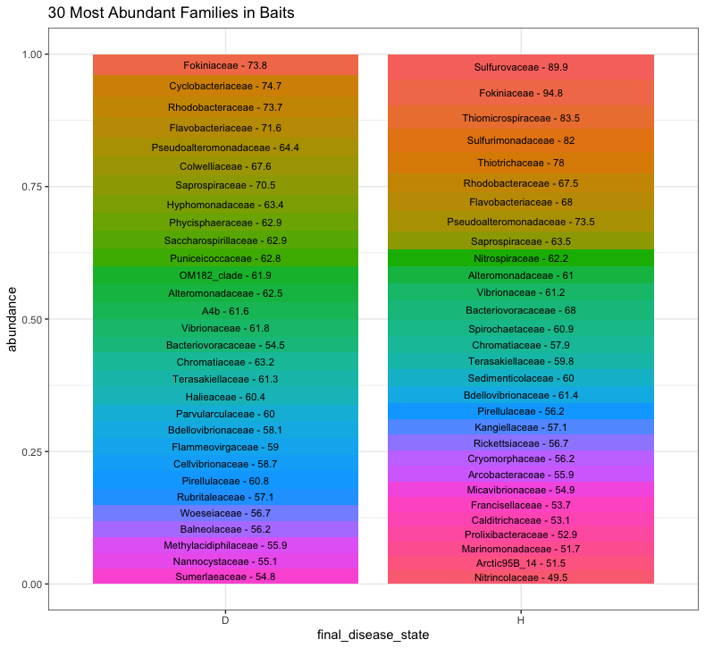
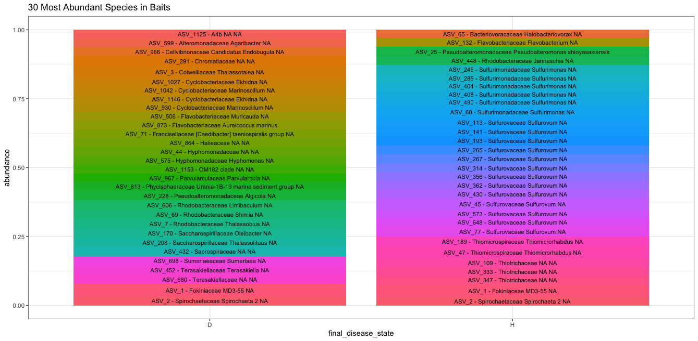
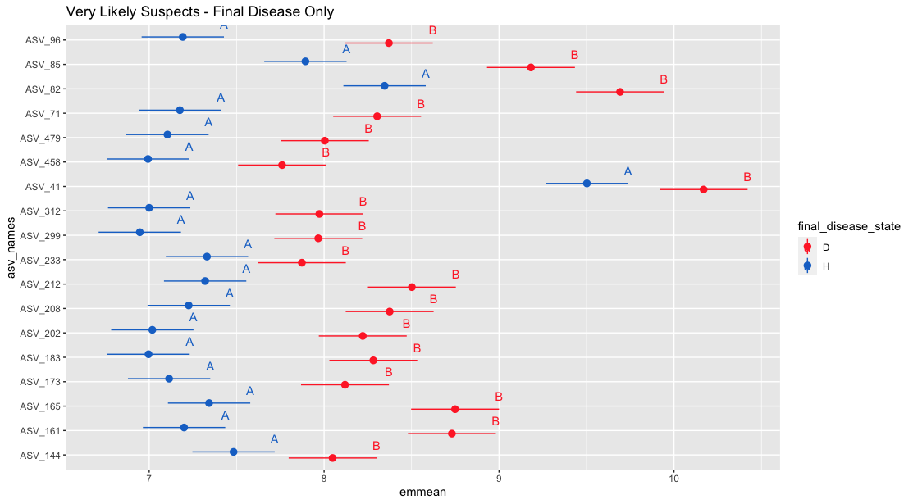
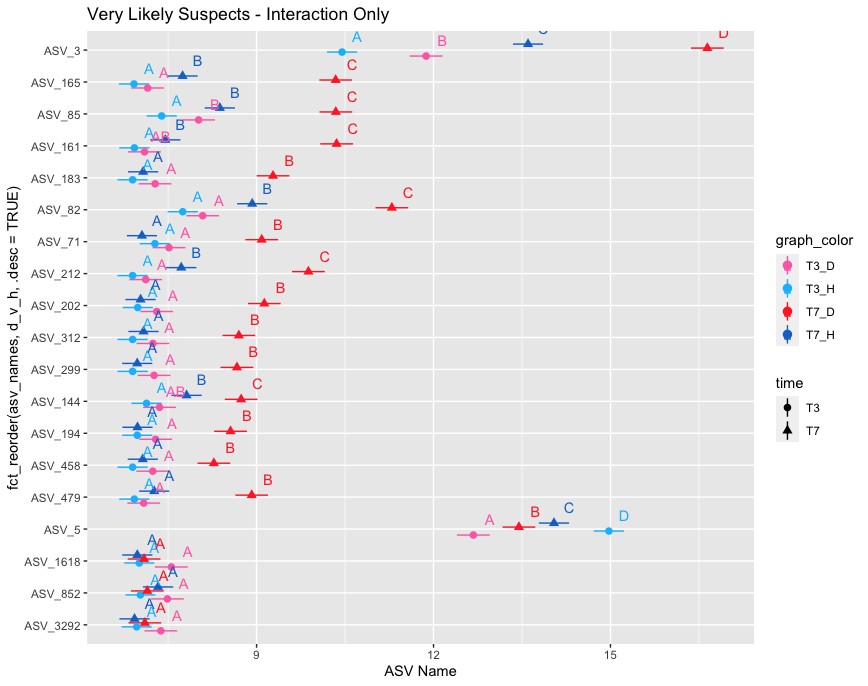

# 16S_Florida_Tank_Analysis

### Time Points 3 and 7

### Baits

\* based on whether the abundance exceeded the threshold of 7.03 (probably the normalized equivalent to 0), which is why some ASVs are present in neither

### Likely Suspects
*present in T3, T7, and Diseased bait*

### Very Likely Suspects
*present in T3, T7, and Diseased bait*   
*AND differs significantly for either final disease state or the interaction of final disease state and time*  
*AND more abundant in diseased than healthy*

#### significant for final_disease_state

#### significant for final_disease_state:time interaction

