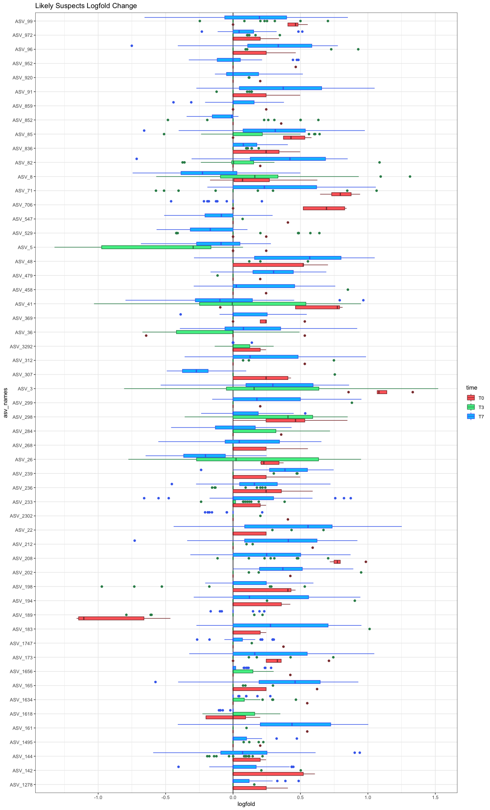
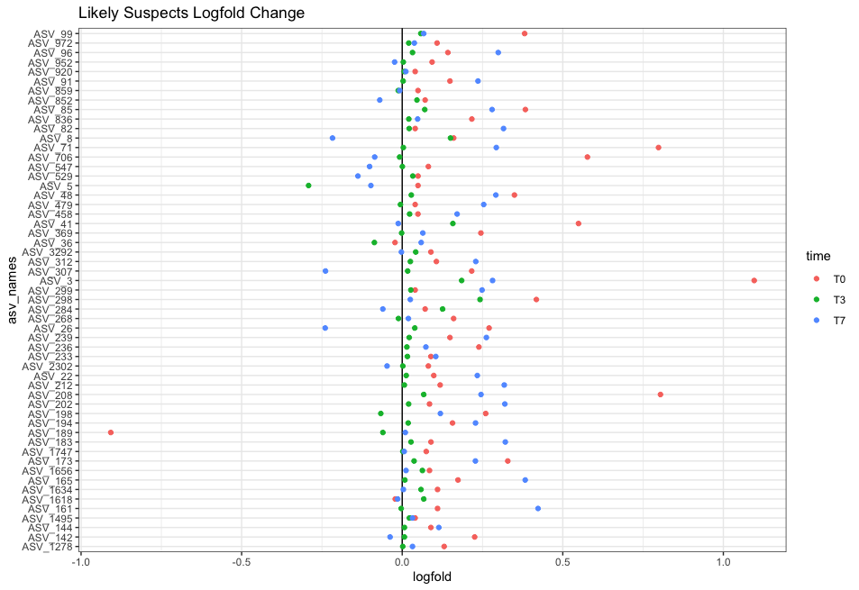
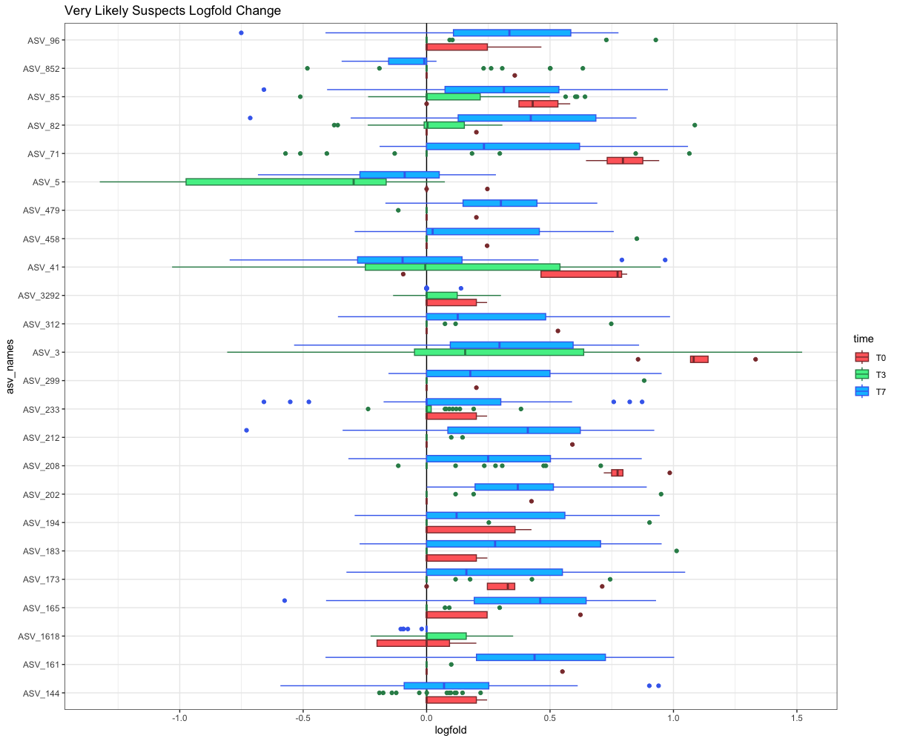
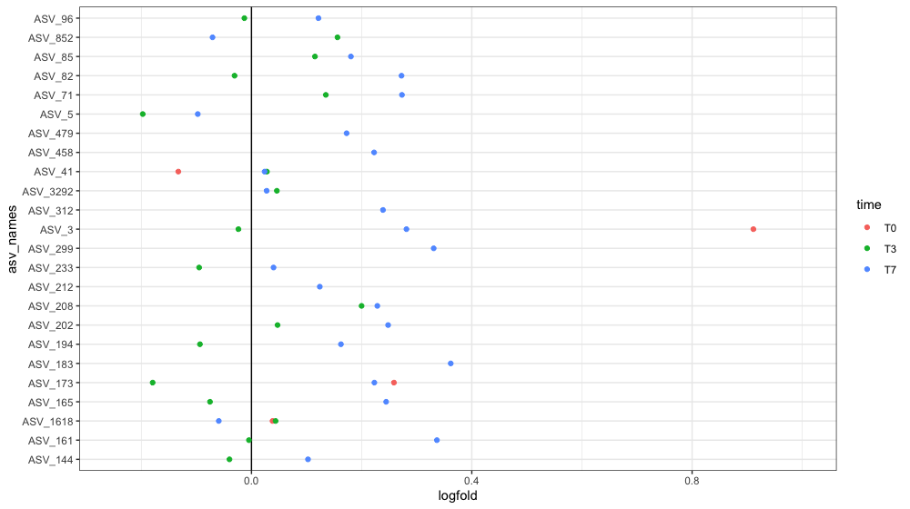

# 16S_Florida_Tank_Analysis

### Time Points 3 and 7
26 most abundant families in each category (time + disease state)

**DISCLAIMER:** the colors are not the same for families between columns, I could not get it to get the colors AND order right no matter what I tried (will need Jason's help to fix it if he knows how)  

### Baits

\* based on whether the abundance exceeded the threshold of 7.03 (probably the normalized equivalent to 0), which is why some ASVs are present in neither

### Likely Suspects
*present in T3, T7, and Diseased bait*

### Very Likely Suspects
*present in T3, T7, and Diseased bait*   
*AND differs significantly for either final disease state or the interaction of final disease state and time*  
*AND more abundant in diseased than healthy*

#### significant for final_disease_state

#### significant for final_disease_state:time interaction

#### significant for BOTH final_disease_state:time interaction AND final_disease_state

### Logfold Changes in Bacterial Abundance
log2 fold difference, positive means more disease

##### Likely Suspects

##### Very Likely Suspects

### Random Effect Sizes
random effects are larger in the healthy tanks

*tank_model <- lmer(value ~ time + (1 | tank), data = filter(tank_data, final_disease_state == "D"))*

#H: ~ time, tank is 0.0287, ~ tank, time is 0.08549  
#D: ~ time, tank is 0.006784, ~ tank, time is 0.002925  

*tank_exposure_model <- lmer(value ~ final_disease_state + (1 | tank) + (1 | time) + (1 | asv_names), 
                   data = filter(tank_data, exposure == "H"))*  

  
#H: asv_names - 0.71949, tank - 0.02200, time - 0.07243   
#D: asv_names - 0.744188, tank - 0.003628, time - 0.034126  

