# 16S Florida Tank Analysis

## Alpha Diversity

- lmer model with formula of "log2_cpm ~ treatment + (1 | genotype) + (1 | tank)"
- treatment is time, exposure, and susceptibility all combined into one descriptor
- all significant for treatment (only one alpha div metric wasn't sig so not included here)

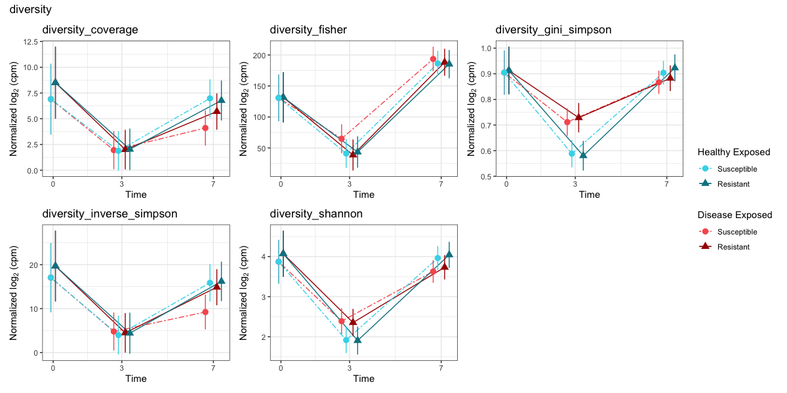  

##### Diversity

#inverse_simpson is an indication of the richness in a community with uniform evenness that would have
    #the same level of diversity, calculated as 1/lambda where lambda is the simpson index

#gini-simpson measures the probability that two randomly selected individuals belong to different species
    #1 - lambda where lambda is the simpson index

#shannon shows how diverse the species in a given community are
    #It rises with the number of species and the evenness of their abundance

#fisher's alpha describes mathematically the relationship between the number of species
    #and the number of individuals in those species

#coverage gives the number of groups needed to have a given proportion of the ecosystem occupied
    #(by default is 0.5 ie 50%)

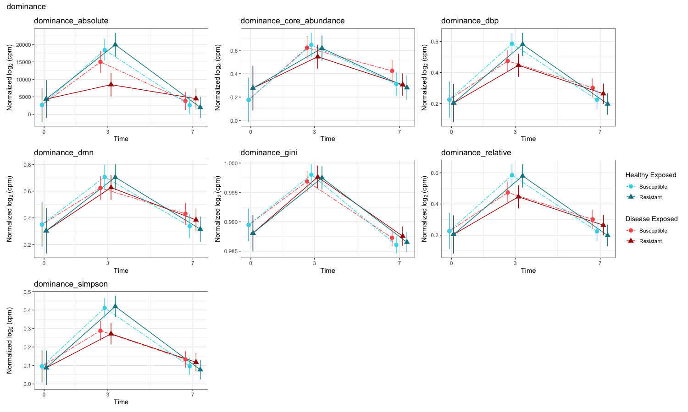  

##### Dominance

#dbp is the relative abundance of the most abundant species of the sample.
    #Index gives values in interval 0 to 1, where bigger value represent greater dominance

#dmn is the sum of relative abundances of the two most abundant species of the sample

#absolute index equals to the absolute abundance of the most dominant n species of the sample
    #(specify the number with the argument ntaxa)

#relative index equals to the relative abundance of the most dominant n species of the sample
    #(specify the number with the argument ntaxa). This index gives values in interval 0 to 1

#simpson's lambda is the probability that two randomly chosen individuals belongs to the same species.
    #The higher the probability, the greater the dominance

#core_abundance is the sum of relative abundances of core species in the sample.
    #Index gives values in interval 0 to 1, where bigger value represent greater dominance
    #Core species are species that are most abundant in all samples
    #Relative proportion of the core species that exceed detection level 0.2% in over 50% of the samples

#gini measures how unevenly abundances are distributed
    #If there is small group of species that represent large portion of total abundance of microbes,
    #the inequality is large and Gini index closer to 1. If all species has equally large abundances,
    #the equality is perfect and Gini index equals 0

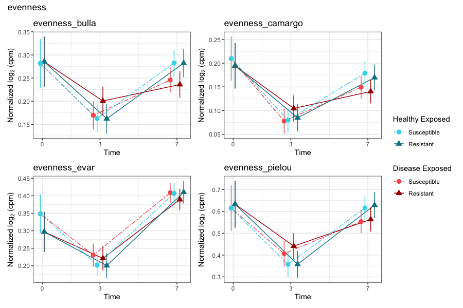  

##### Evenness

#camargo's compares proportions of individuals between sites, with 1 being even and 0 being patchy
    #relatively unaffected by sites with very few organisms, and is unaffected by site richness

#simpson's evenness is a variant of the reciprocal Simpson index
    #Index values range from near 0 (1/s) (patchy or skewed) to 1 (even), and the index
    #is relatively unaffected by sites with very few individuals.

#pielou is shannon diversity index value divided by the maximum possible shannon diversity index given
    #complete evenness (proportion 0 to 1) - closer to 1 is closer to complete evenness

#evar is based on the variance in abundance over the species taken over log abundance
    #so proportional differences are compared, then converted to a 0-1 scale by arctan

#bulla gives equal weight to all species regardless of abundance so it's
    #sensitive to the presence of rare species
    
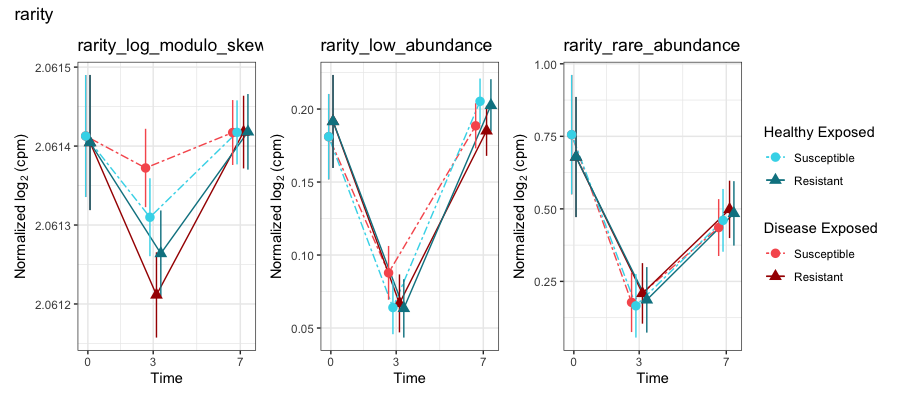  

##### Rarity and low abundance

#log_modulo_skewness is a rarity index that characterizes the concentration of species at low abundance.
    #It uses the skewness of the frequency distribution of arithmetic abundance classes

#low abundance gives the concentration of species at low abundance, or the relative proportion of rare
    #species in [0,1].The species that are below the indicated detection threshold are considered rare.
    # #use "detection = " (ex: detection = 0.2/100)
    #Note that population prevalence is not considered. If the detection argument is a vector,
    #then a data.frame is returned, one column for each detection threshold.

#rare abundance gives the relative proportion of rare species in the interval [0,1].
    #(rare = those that are not part of the core microbiota)
    #This is the complement (1-x) of the core abundance. The rarity function provides the
    #abundance of the least abundant taxa within each sample, regardless of the population prevalence.

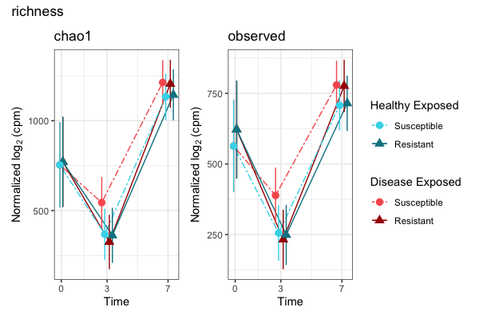  

##### Richness 

#observed is observed species richness

#chao1 is nonparametric method for estimating the number of species in a community,
    #based on the concept that rare species infer the most information about the number of missing species
    #particularly useful for data sets skewed toward the low-abundance species

## Other Analysis

### Somewhat Unfiltered Data
only filtered for 20% prevalence & less than 90% missingness

### Everything that goes into the model:
- filter 20% prevalence, less than 90% missingness, remove ASVs with an average of less than *100* cpm per sample
- removed anything that was only T3 & T7 or only T3 or only T7

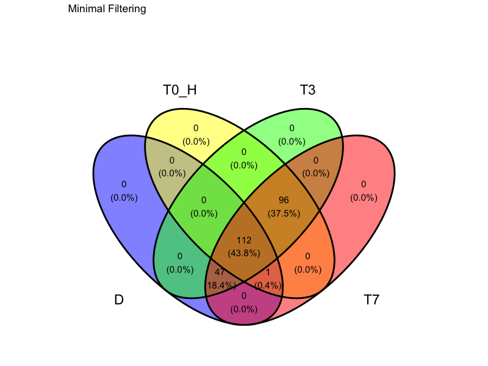

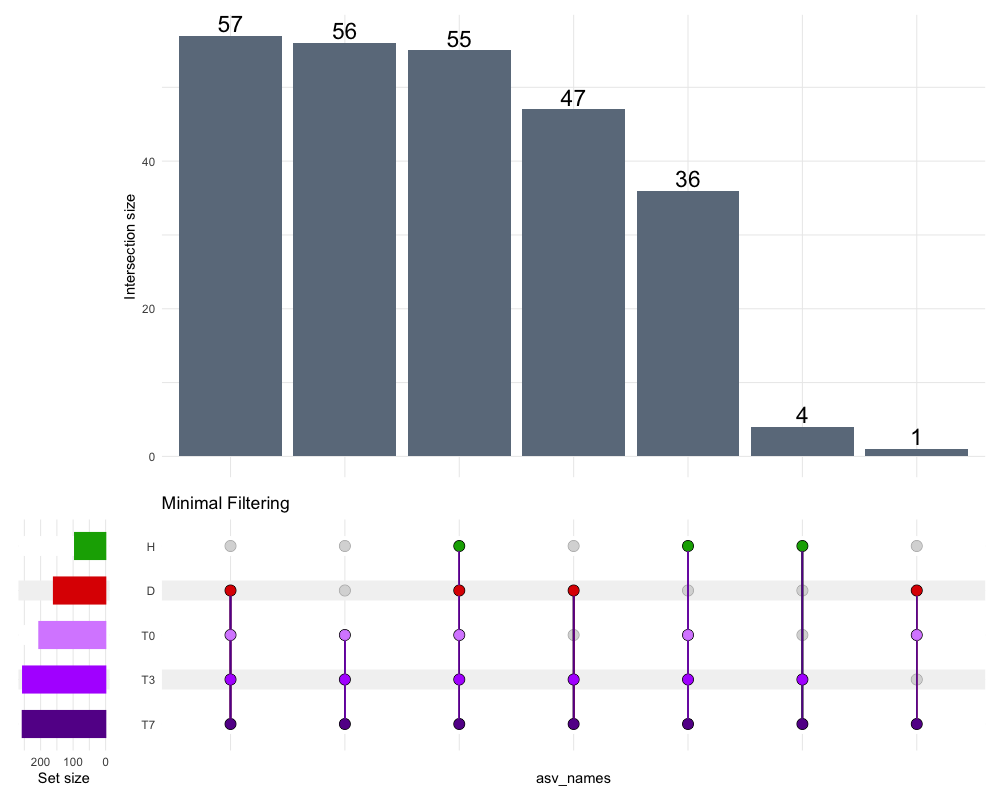

## Current Model

from Vega Thurber et al 2020:

- filter 20% prevalence, less than 90% missingness, remove ASVs with an average of less than *100* cpm per sample
- removed anything that was only T3 & T7 or only T3 or only T7  
- lmer model with formula of "log2_cpm ~ treatment + (1 | genotype) + (1 | tank)"
- treatment is time, exposure, and susceptibility all combined into one descriptor
- examine fdr corrected p-values for treatment, genotype, and tank: only keep ASVs w/ significant effect of treatment
- make planned comparisons, then group ASVs into early/late/continuous and probiotic/opportunist/pathogen based on expected profiles for those strategies

**Early Pathogen:** Disease-Exposed Susceptible is greater than Disease-Exposed Resistant at T3  
AND Disease-Exposed Susceptible is greater than the average of all other T3 treatments   
AND Disease-Exposed Susceptible must be more abundant at T3 than T0  
**Late Pathogen:** Disease-Exposed Susceptible is greater than Disease-Exposed Resistant at T7  
AND Disease-Exposed Susceptible is greater than the average of all other T7 treatments   
AND Disease-Exposed Susceptible must be more abundant at T7 than T0  
**Continuous Pathogen:** meets all criteria for both early and late pathogens

**Early Opportunist:** the average of Disease-Exposed is greater than the average of Healthy-Exposed at T3  
AND Disease-Exposed is more abundant at T3 than T0  
**Late Opportunist:** the average of Disease-Exposed is greater than the average of Healthy-Exposed at T7  
AND Disease-Exposed is more abundant at T7 than T0  
**Continuous Opportunist:** meets criteria for both early and late opportunists  

**Probiotic_T7_Strict:** Disease-Exposed Resistant is more abundant than Disease-Exposed Susceptible at T7   
AND Disease-Exposed Resistant is more abundant than all other treatments at T7  
AND Disease-Exposed Resistant is more abundant at T7 than at T3  
AND Disease-Exposed Resistant is more abundant at T7 than Resistant at T0  

**Crasher_T3:** Susceptible is more abundant at T0 than Disease-Exposed Susceptible is at T3  
**Crasher_T7:** Susceptible is more abundant at T0 than Disease-Exposed Susceptible is at T7    

##### Planned Comparisons where Nothing was Found:

-- none in T0,T3 and anything in probiotic T7 but not probiotic T7 Strict did not look like a probiotic (all treatments had very similar values in most cases) --
**Probiotic_T0:** Disease-Exposed Resistant is more abundant than Disease-Exposed Susceptible at T0  
**Probiotic_T3:** Disease-Exposed Resistant is more abundant than Disease-Exposed Susceptible at T3  
**Probiotic_T7:** Disease-Exposed Resistant is more abundant than Disease-Exposed Susceptible at T7  

**Probiotic_T3_Strict:** Disease-Exposed Resistant is more abundant than Disease-Exposed Susceptible at T3  
AND Disease-Exposed Resistant is more abundant than all other treatments at T3  
AND Disease-Exposed Resistant is more abundant at T3 than Resistant at T0

**Crasher_T3_Strict:** Susceptible is more abundant at T0 than Disease-Exposed Susceptible is at T3  
AND Disease-Exposed Susceptible is less than the average of all other treatments at T3  
**Crasher_T7_Strict:** Susceptible is more abundant at T0 than Disease-Exposed Susceptible is at T7
AND Disease-Exposed Susceptible is less than the average of all other treatments at T7  

##### Model Results:

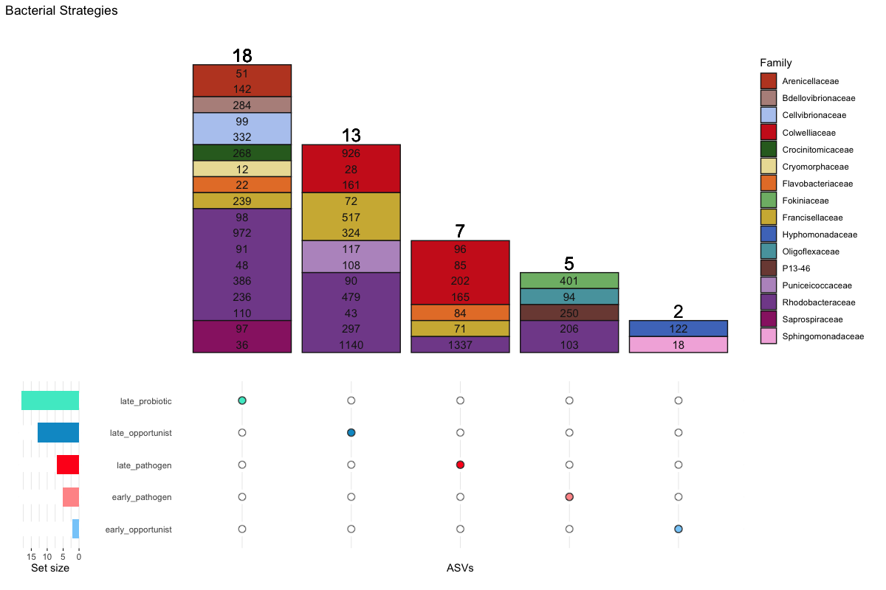  

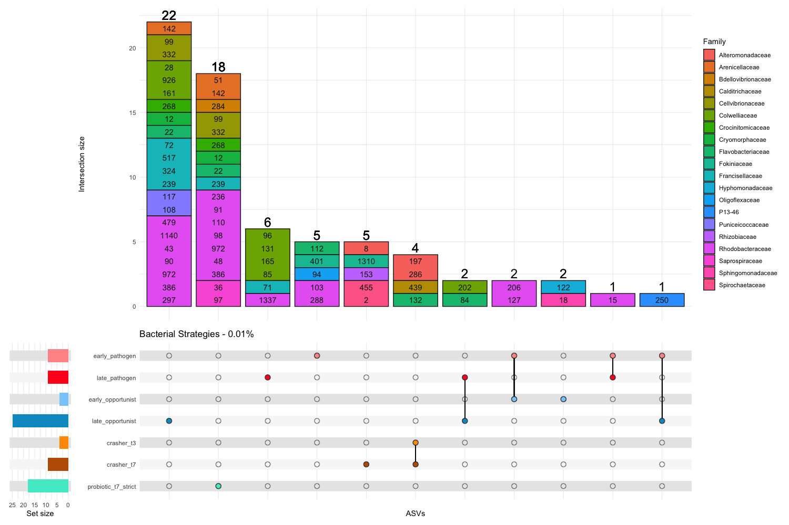

removed T3 and T7 from complex upset because all ASVs are present in both
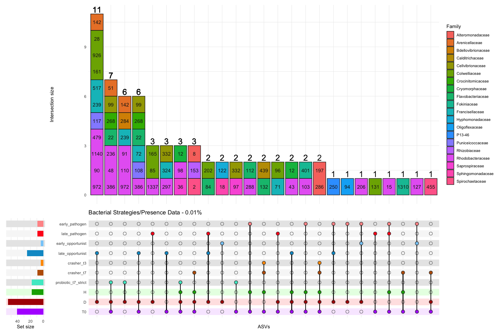

#### Correlation Matrices

Correlations between the 8 putative pathogen candidates identified by our model  
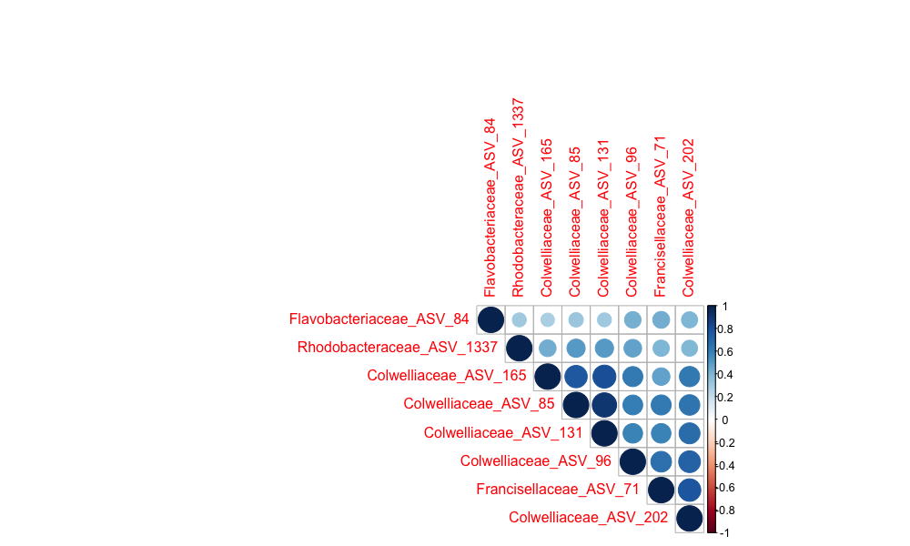  

Correlations between all ASVs of the genus Thalassotalea (Colwelliaceaes)  
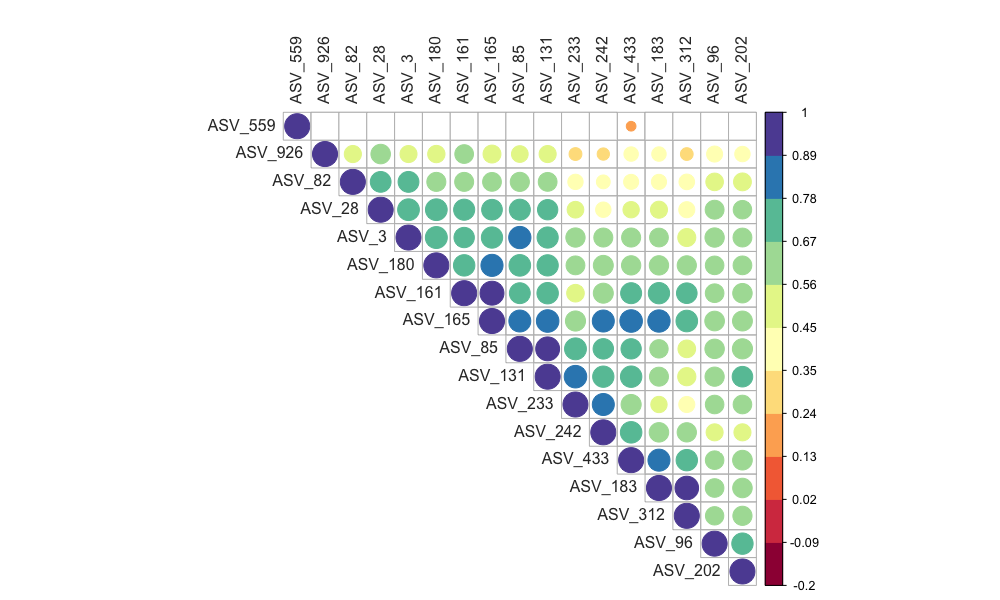   

#### Heritability

top 10 highest heritability scores

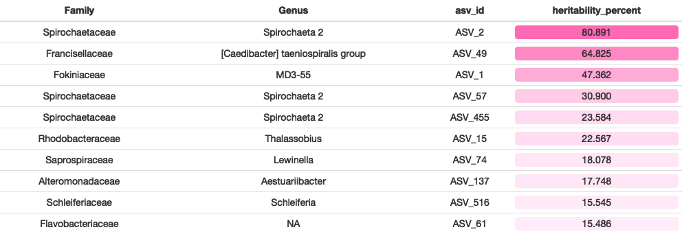  

heritability of putative pathogen candidates

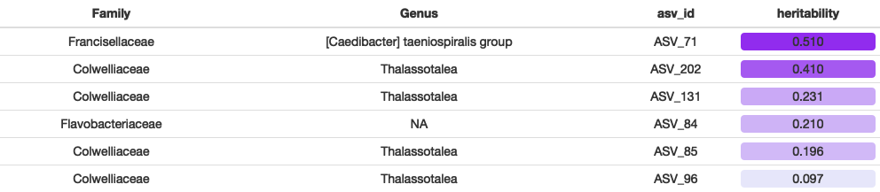  

#### ASV NMDS by bacterial strategy  

95% confidence intervals around significant factors 
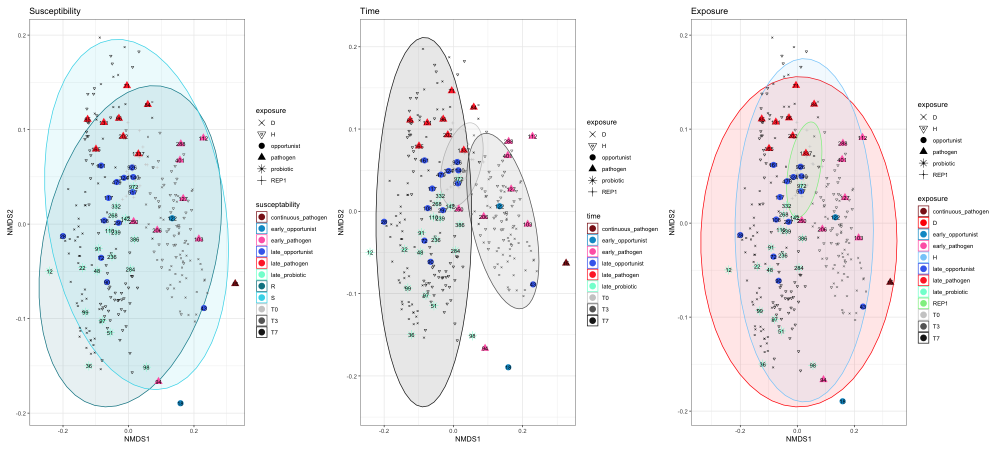  
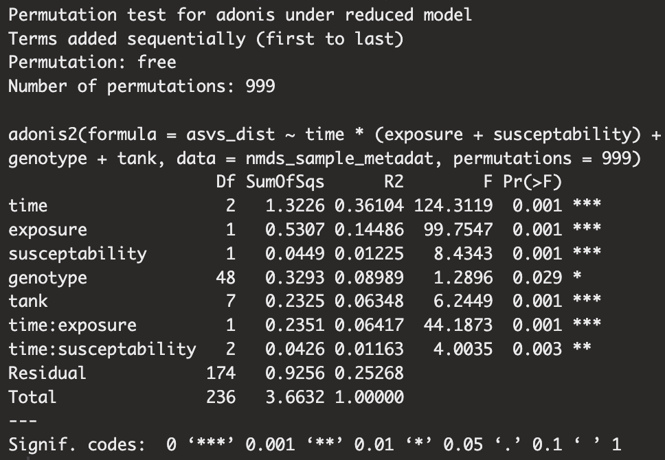

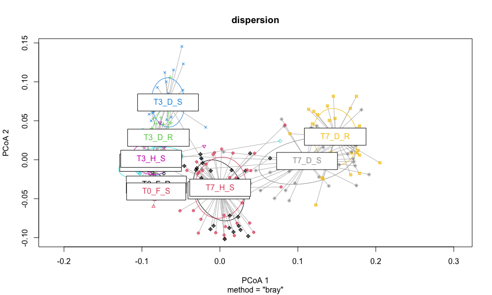   

95% confidence interval around exposure + resistance combos, faceted by timepoint
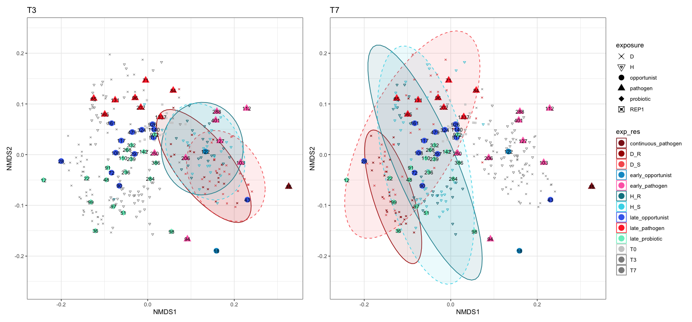  

PCOA with 95% confidence intervals  
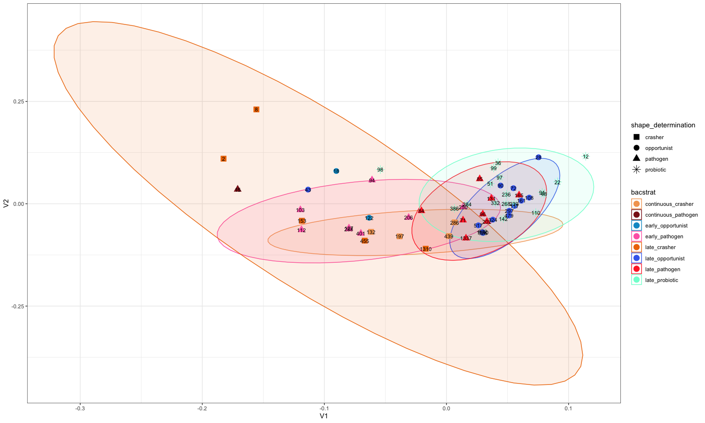  

### Microbe Abundances
- category titles are "timepoint_exposure_susceptibility"

# OLD

### Potential Link between Rickettsiales and Disease

