# 16S_Florida_Tank_Analysis

### Family Abundances

**DISCLAIMER:** the colors are not the same for families between columns, I could not get it to get the colors AND order right no matter what I tried (will need Jason's help to fix it if he knows how)  

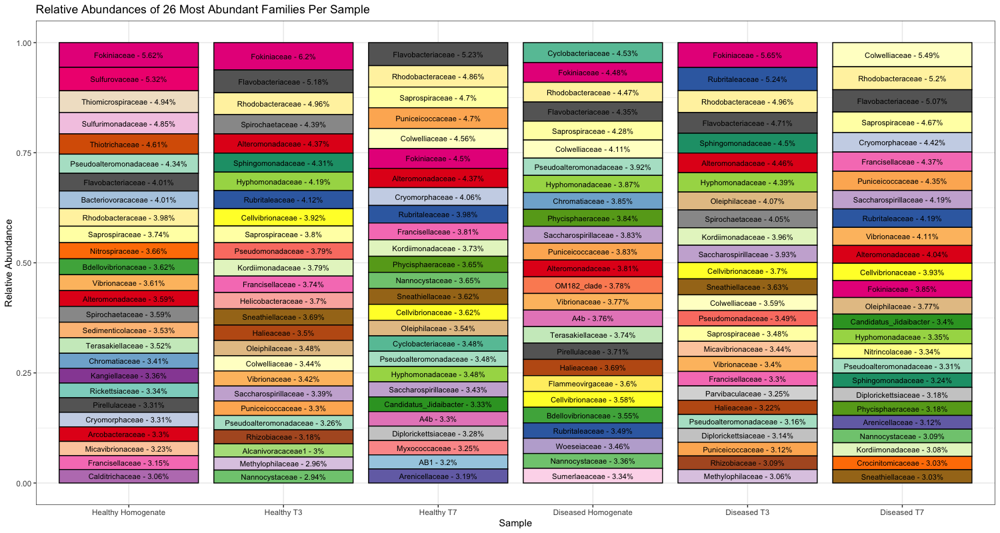

### Homogenates
**DISCLAIMER:** the colors are not the same for ASVs between columns (same problem)  

Selected 30 most abundant species per homogenate type, then calculated abundance of each family, ranked by family abundance (within each family, ranked by species abundance)  

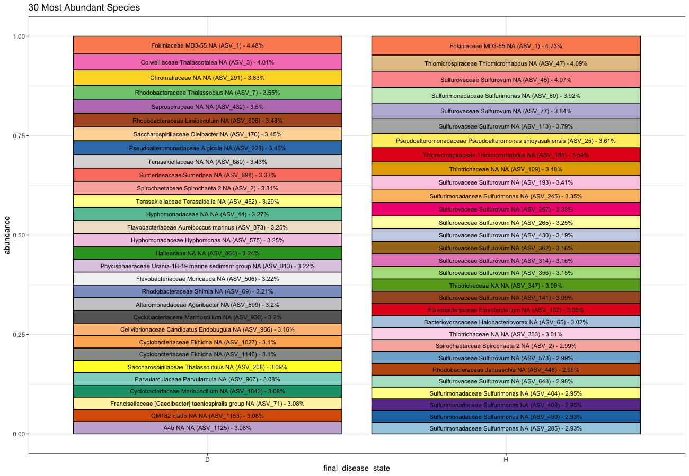

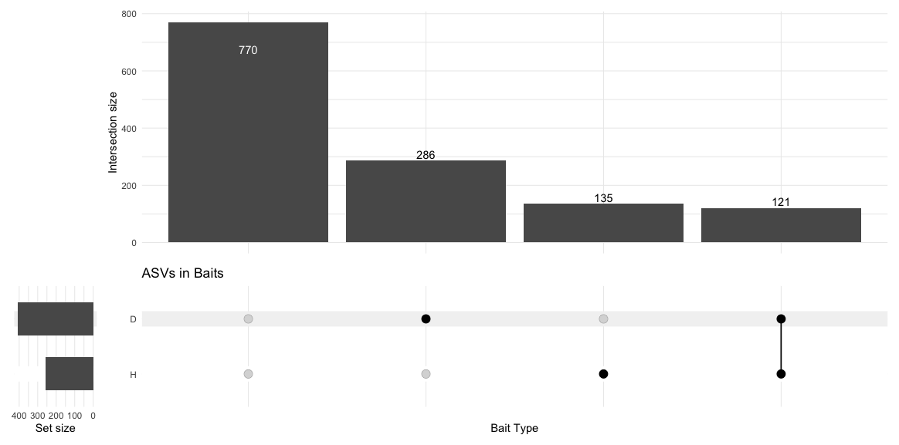
\* based on whether the abundance exceeded the threshold of 7.03 (probably the normalized equivalent to 0), which is why some ASVs are present in neither

### Likely Suspects
*present in T3, T7, and Diseased bait*

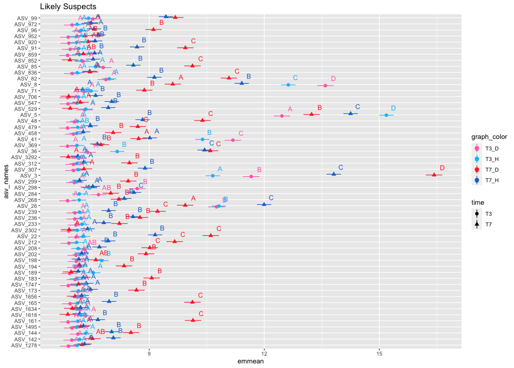

### Very Likely Suspects
*present in T3, T7, and Diseased bait*   
*AND differs significantly for either final disease state or the interaction of final disease state and time*  
*AND more abundant in diseased than healthy*

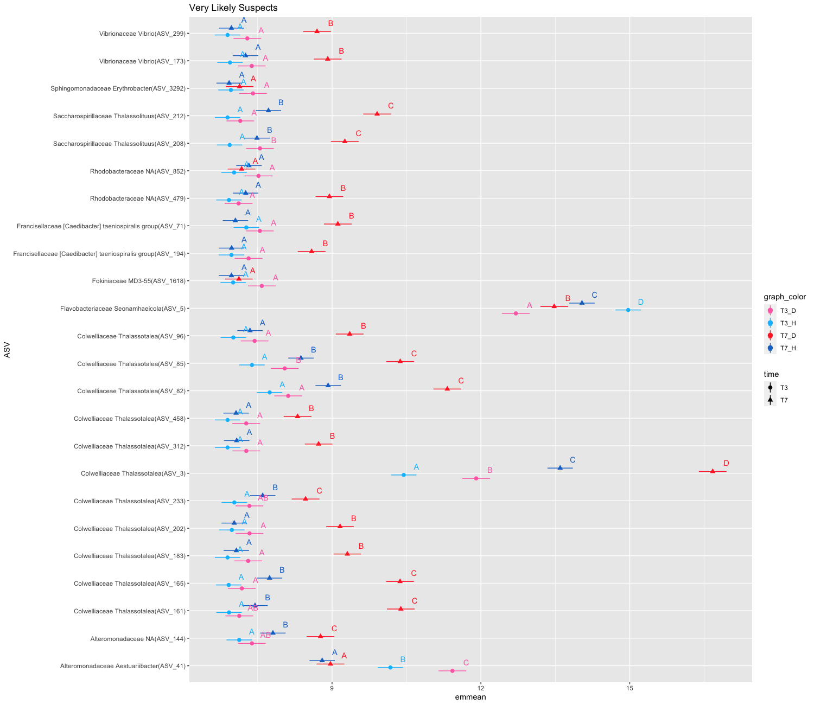

### Next 3 graphs ranked in order of difference between diseased and healthy: 
y-axis is Family and Genus (species is NA for most ASVs)

#### significant for final_disease_state
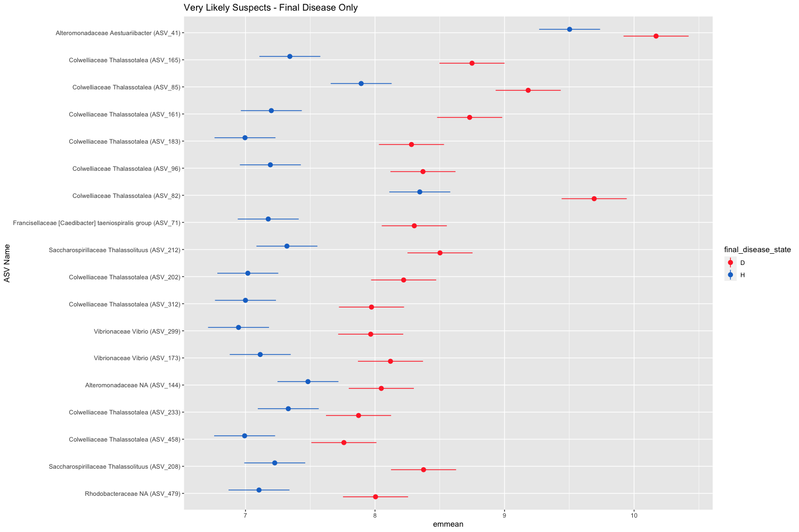

#### significant for final_disease_state:time interaction
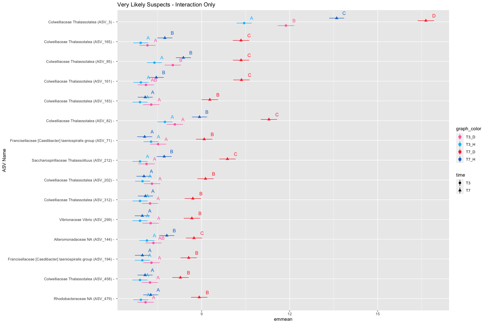

*removed the 4 that didn't make sense but I checked their d_v_h value and it WAS negative for all 4*  
The reason ASV 5 was acting weirdly and seemed to be more abundant in Healthy despite our filter is because our disease vs. healthy parameter is based on T0.  ASV 5 was more abundant in diseased at T0 but more in healthy at T3 and T7

#### significant for BOTH final_disease_state:time interaction AND final_disease_state
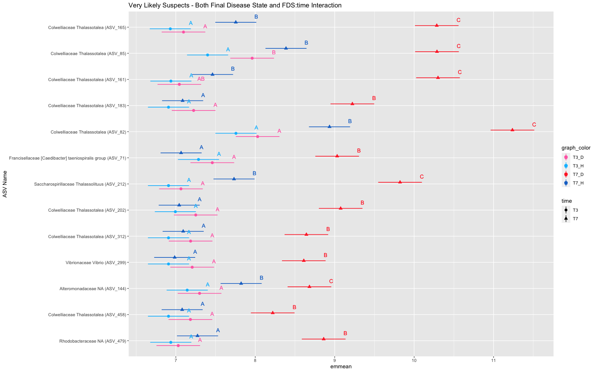

### Logfold Changes in Bacterial Abundance
- positive logfold change means more disease
- filtered based on which ASVs were more abundant in diseased homogenate than healthy homogenate (T0) with the caveat that either the T3 or T7 value had to be a positive logfold change (more in diseased than healthy) 
- faceted by whether T3 or T7 was more abundant in disease, ordered within facets by the difference between T7 and T3 values

#### One lmer model for all time steps

model used: log_emmeans_aov <- lmer(log_value ~time * final_disease_state * asv_names + (1 | tank) + (1 | genotype), data = log_emmeans_data)

**Note:** I think it would make more sense as T0 (yellow), T3 (orange), T7 (red) but here's the color scheme you wanted:

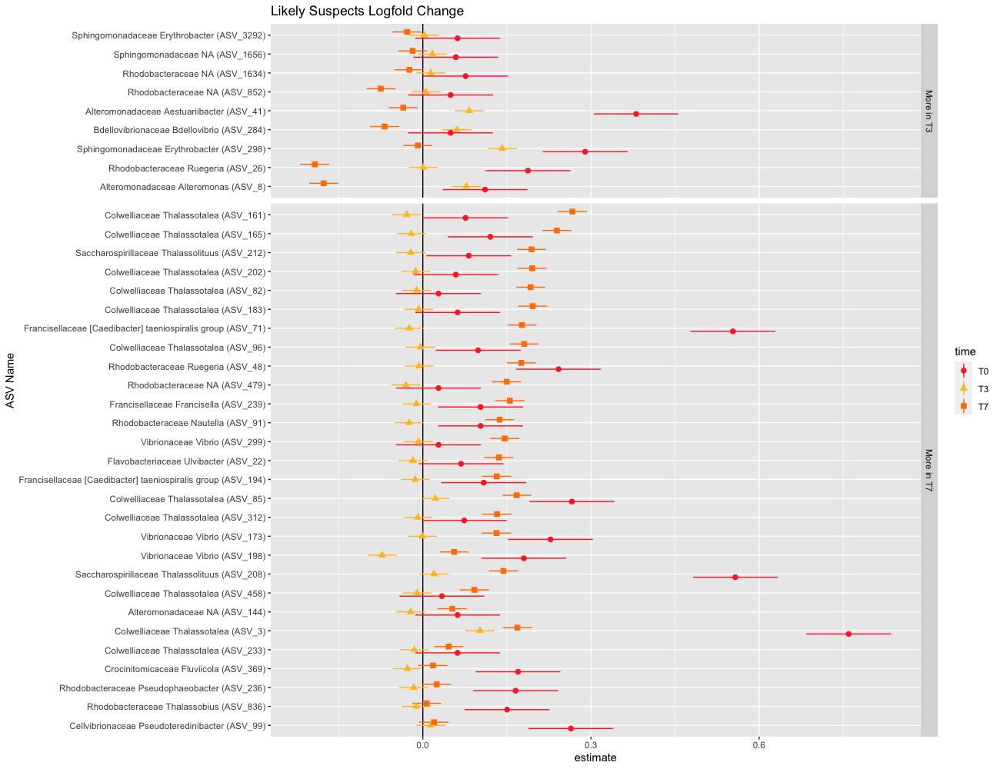

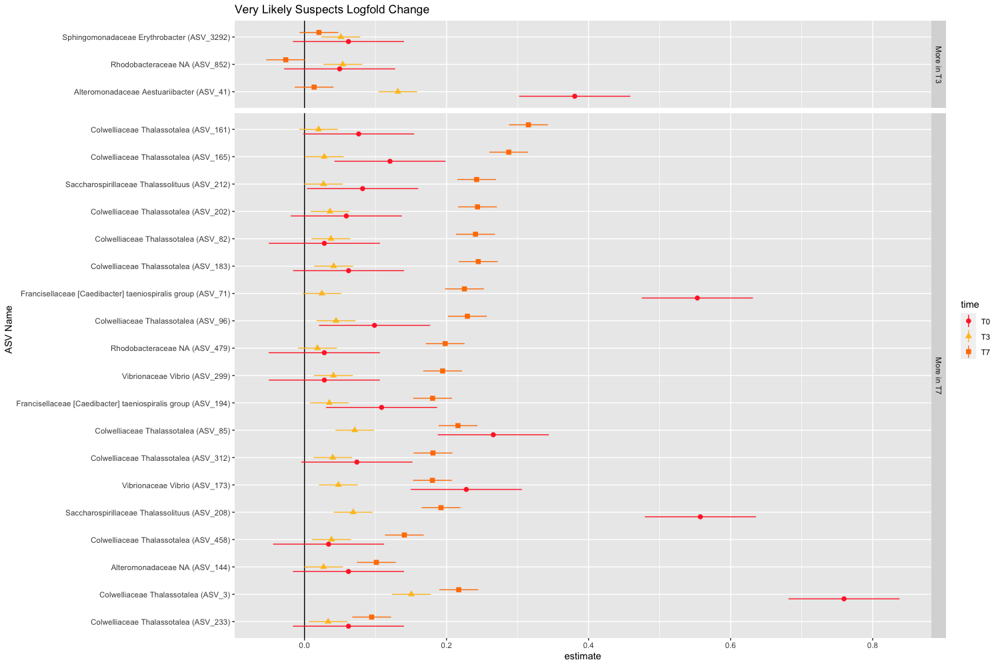

#### Two separate models (aov_4 for T3,T7 and lmer for T0)

model used (T3 + T7): aov_4(log_value ~time * final_disease_state * asv_names + (1 + time | frag_ASV_id), data = log_emmeans_data_37)

model used (T0): lmer(log_value ~final_disease_state * asv_names + (1 | genotype), data = log_emmeans_data_0)

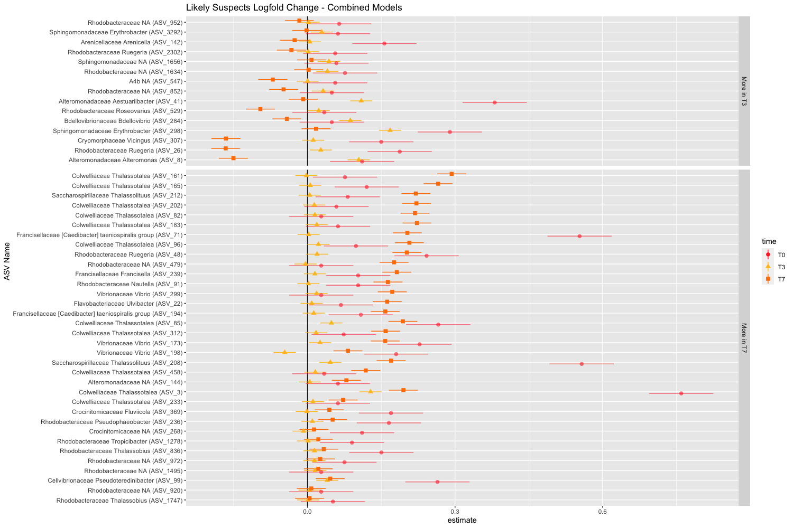

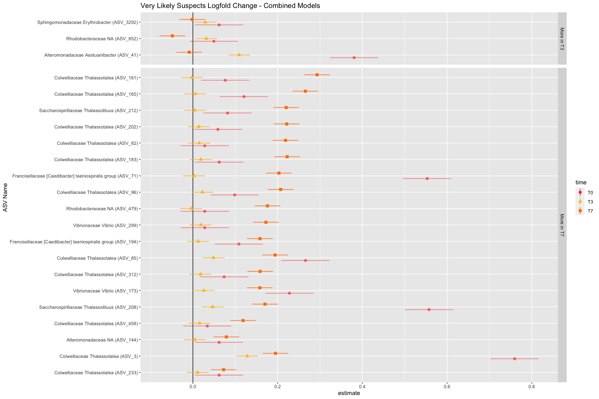

### Random Effect Sizes
random effects are larger in the healthy tanks

*tank_model <- lmer(value ~ time + (1 | tank), data = filter(tank_data, final_disease_state == "D"))*

#H: ~ time, tank is 0.0287, ~ tank, time is 0.08549  
#D: ~ time, tank is 0.006784, ~ tank, time is 0.002925  

*tank_exposure_model <- lmer(value ~ final_disease_state + (1 | tank) + (1 | time) + (1 | asv_names), 
                   data = filter(tank_data, exposure == "H"))*  
                   
#H: asv_names - 0.71949, tank - 0.02200, time - 0.07243   
#D: asv_names - 0.744188, tank - 0.003628, time - 0.034126  

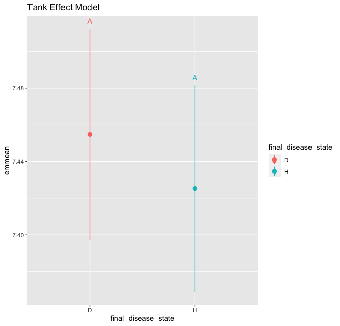  

