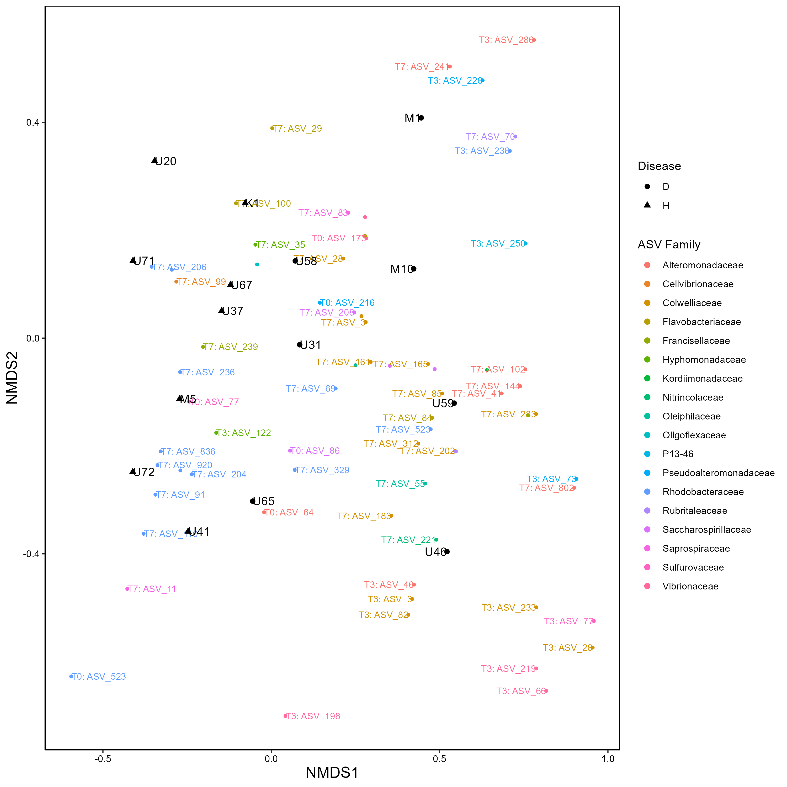
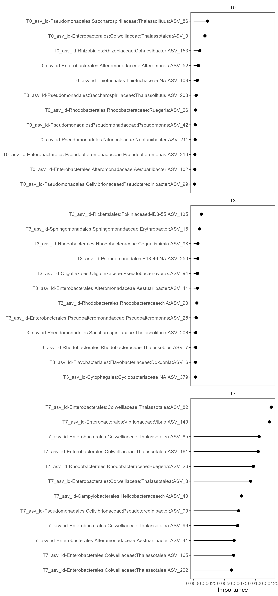
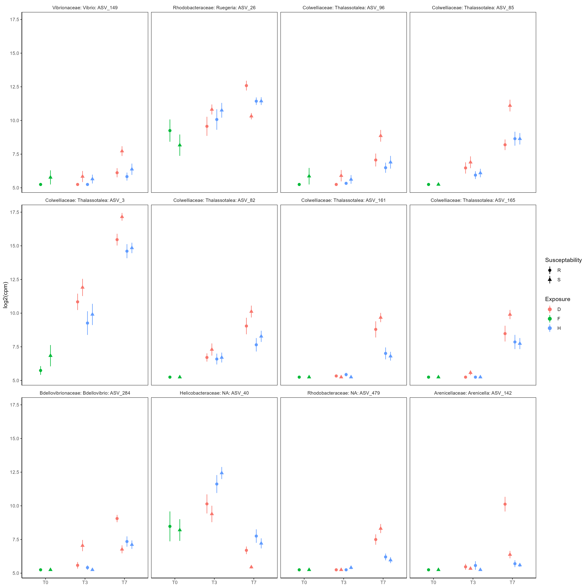
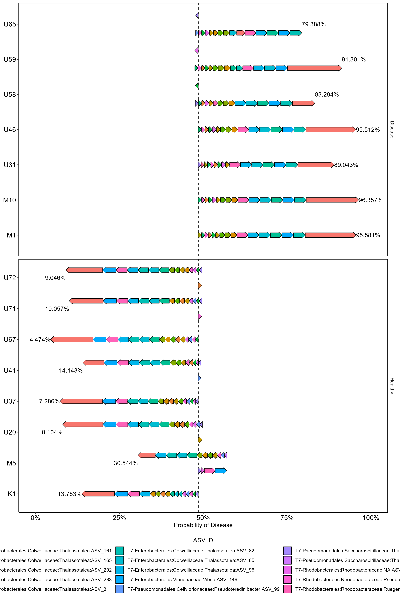
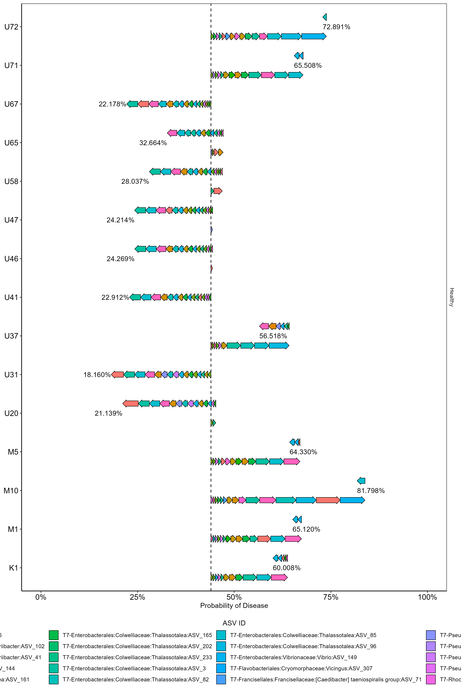

Using the same filtered ASV dataset as used in the primary linear mixed model analysis I used a random forest to classify coral fragments exposed to the disease treatment as either healthy or diseased based on the normalized ASV counts at each timepoint (T0, T3, T7).

In order to perform this analysis I reduced the dataset to include only 15 coral genotypes which had data across all timepoints in the diseased treatment.

First I used an NMDS to visualize differences between bacterial communities. ASVs included are only those significantly associated with NMDS1 and/or NMDS2.

The data was then split into training (4D, 5H) and testing (3D, 3H) datasets. Data was preprocessed by first downsampling to have the same number of diseased and healthy genotypes, then ASVs containing 0 variance across samples were removed and all ASV counts were log base2 transformed prior to mean/sd normalization.

The random forest hyperparameters: mtry, trees, and min_n were optimized for classification accuracy on the training data using 3-fold cross validation repeated 10 times initially on a regular grid of 10 random settings and further optimized using Bayesian optimization to identify the hyperparameters which maximize identification accuracy of the hold-out data across the repeated cross validation samples. The model accuracy was then assessed using the testing dataset and found to be 100% accurate. Optimal parameters were found to be: mtry = 164, trees = 9,924, min_n = 2 (settings subject to change due to RNG).

The top 12 most important ASVs, based on permutation importance, in predicting final disease state from each timepoint were identified and plotted below. All the most important ASVs were from the T7 timepoint.

Each of the top 12 overall most important ASVs was then plotted through time to see how the ASV count changes across time and all treatments.

For each genotype exposed to the disease I created a SHAP plot to see how individual ASVs influenced the predicted outcome.

I also produced SHAP plots to predict the outcome of the healthy exposed samples to identify if any are likely to develop the disease after the experiment was completed.

